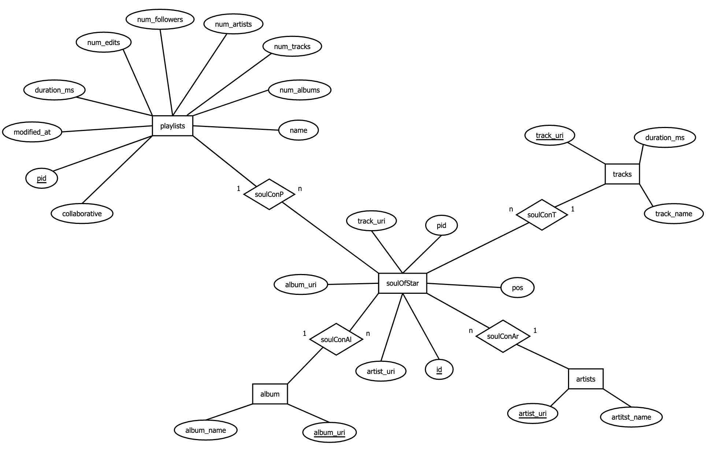
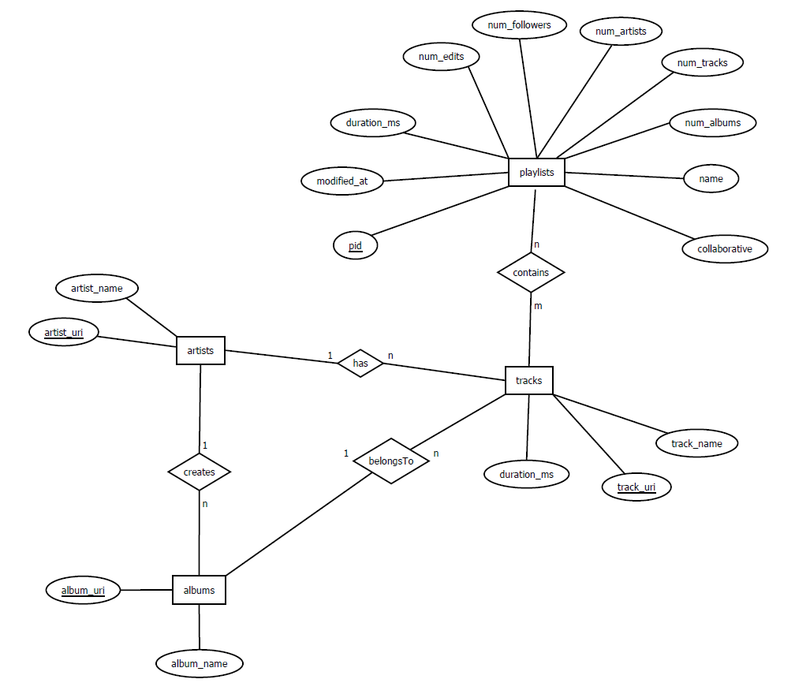

# <center> Data Science WS 2021/2022 <br/> Dokumentation - Lösung der AI crowd Spotify Million Playlist Dataset Challenge mittels Assoziationsanalyse

**Hinweis**: Um die gezeigten Code-Ausschnitte in dieser Dokumentation auszuführen, muss zum Teil ein SSH-Tunnel zur Datenbank bestehen. 
Zudem müssen zum Ausführen mancher Methoden zuvor bestimmte CSV-Dateien erstellt werden. Es empfiehlt sich hierzu das **src/README.md** zu lesen.

## Gliederung
* Begrifflichkeiten   
* Ziel
* Analyse des Datensatzes
* Preprocessing
  * DB-Schema
  * CSV-Dateien in DB laden  
* Ansatz I - Vorhandenes Repository umbauen
  * Umbau
  * Probleme  
* Ansatz II - Library von mlxtend verwenden
  * Data-Input
  * Die mlxtend Library
  * Probleme mit mlxtend  
* Ansatz III - Dictionaries & Neuer Algorithmus
  * Idee
  * Umsetzung  
  * Probleme & Lösungen
* Recommendation
  * Ansätze
  * Umsetzung
  * Methoden  
* Mitwirken der Teammitglieder
* References

## Begrifflichkeiten
Um das grundsätzliche Verständnis zum Code und dieser Dokumentation zu fördern, erläutern wir im folgenden häufig verwendete Bergriffe bzw. Variablennamen:
* `items` = {`track_name`, `track_uri`, `artist_uri`,`album_uri`, `name` (Playlist-name), `pid`}
* `itemSet`: Eine Menge unterschiedlicher items gleicher Art. Meistens in Form eines `frozensets` um sie einem `set` anzufügen zu können.
* `c1ItemSet`: ItemSets der Länge 1, welche auch unter `minSup` liegen
* `l1ItemSet`: ItemSets der Länge 1, welche über `minSup` liegen
* `l2ItemSet`: ItemSets der Länge 2, welche über `minSup` liegen
* `antecedents`: Eine Menge von Vorgängern in Form von `itemSets`, von denen ausgehend eine Vorhersage getroffen werden kann.
* `consequents`: Die Vorhersage (auch Nachfolger) in Form einer Menge von `itemSets`, welche durch eine Regel erzeugt werden kann.
* `confidence`: Die Konfidenz steht für die Wahrscheinlichkeit, dass die Nachfolger eintreten, gegeben der Wahrscheinlichkeit, dass die Vorgänger bereits eingetroffen sind.
* `minSup`: Abkürzung von minimum Support. Bezeichnet die totale Anzahl von Transaktionen bzw. Playlists in denen ein `itemSet` vorkommen soll.  
* `rule` = `[{A, ...}, {B, ...}, Konfidenz]` bzw. `[antecedent, consequent, confidence]`  
  In den meisten Fällen bestehen beide Mengen aus nur einem Element. Eine Regel könnte also lauten:  
  `[{A}, {B}, 0.5]`.  
  In diesem Fall kann die Regel wie folgt gelesen werden:  
  "Wenn der Track A in der Playlist enthalten ist, wird zu 50% auch Track B enthalten sein."   
* `candidates`: Bezeichnet eine Menge von `itemSets`, welche noch nicht auf `minSup` geprüft ist.
* **frequent**: `itemSets` werden frequent genannt, wenn sie über `minSup` liegen.
* `maxPid`: Definiert die größtmögliche ***pid***, mit welcher das Programm rechnen soll. Dadurch wird die größe des Datensatzes bestimmt.  
  Beispiel: Liegt `maxPid` bei 1000, wird mit 1000 Playlists gerarbeitet.
* **pname**: Der Name einer Playlist  
* `kMax`: Gibt die maximale Länge der itemSets an, die erstellt werden sollen.

## Ziel
Um die Challenge zu bewältigen, gilt es zwei Anforderungen an die Regeln zu stellen.
1. Wir benötigen mehrere Regeln pro Track. Je nach Szenario und Recommendation-Verfahren schwankt die Anzahl der Regeln, 
   die wir für einen einzelnen Track benötigen. Es gilt, je weniger Tracks wir gegeben haben, desto mehr Regeln 
   benötigen wir für einen einzelnen Track bzw. Playlist-Namen.
2. Wir benötigen für möglichst viele Tracks eine Regel. Je nach Szenario haben wir nur einen Track gegeben, 
   was bedeutet, dass wir für genau diesen Track mehrere Regeln gespeichert haben müssen.
   
Zudem gehen wir davon aus, dass wir nicht wissen für welche Tracks wir eine Vorhersage treffen sollen. Das heißt, 
wir speichern bestenfalls für jeden der ca. 2 Mio. Tracks aus unserem Datensatz eine Regel.

## Analyse des Datensatzes
Um die Anzahl an Tracks zu maximieren, für die wir eine Regel zur Verfügung haben, dient uns als wichtigster 
Parameter `minSup`. Um so kleiner `minSup` gewählt wird, für umso mehr Tracks erhält man eine Regel.  
Damit wir wissen, wie groß wir `minSup` wählen können, um noch genug Regeln zu erstellen, haben wir uns eine Methode 
`printSupInfo(item)` geschrieben, welche auflistet, wie oft welcher Support vorkommt.

```
printSupInfo('track_uri')
```

          support  countSup   mulSup  percentage  percentageCumulative
    0           1   1085315  1085315   47.974134             47.974134
    1           2    319209   638418   14.109982             62.084116
    2           3    162170   486510    7.168394             69.252510
    3           4    101177   404708    4.472323             73.724833
    4           5     70188   350940    3.102517             76.827350
    ...       ...       ...      ...         ...                   ...
    5602    39577         1    39577    0.000044             99.999823
    5603    40629         1    40629    0.000044             99.999867
    5604    40659         1    40659    0.000044             99.999912
    5605    41707         1    41707    0.000044             99.999956
    5606    45394         1    45394    0.000044            100.000000
    
    [5607 rows x 5 columns]
    Support mean:  28.93736794366068


Wie man in der vierten Spalte erkennen kann, haben 47% aller Tracks nur einen Support von 1. 
Für all diese Tracks lassen sich daher keine aussagekräftigen Regeln bilden. Wir haben uns gefragt, ob das eventuell an 
der Eindeutigkeit der ***track_uri*** liegt und eigentlich gleiche Tracks wegen unterschiedlicher Versionen
oder doppelten Uploads nicht als mehrfach gezählt werden können.
Wir haben die Methode deshalb auch für den ***track_name*** durchlaufen lassen, welchen wir zusammen setzten aus
`track_name + " by " + artist_name`.

```
printSupInfo('track_name')
```

          support  countSup   mulSup  percentage  percentageCumulative
    0           1   1039356  1039356   47.465702             47.465702
    1           2    308502   617004   14.088786             61.554488
    2           3    157618   472854    7.198158             68.752646
    3           4     98609   394436    4.503313             73.255959
    4           5     68727   343635    3.138651             76.394609
    ...       ...       ...      ...         ...                   ...
    5628    39577         1    39577    0.000046             99.999817
    5629    40629         1    40629    0.000046             99.999863
    5630    40659         1    40659    0.000046             99.999909
    5631    41707         1    41707    0.000046             99.999954
    5632    45394         1    45394    0.000046            100.000000
    
    [5633 rows x 5 columns]
    Support mean:  29.869469274087443

Das Ergebnis ist leider ziemlich das gleiche.  
Wir haben die Methode auch für die Künstler, Alben und Playlist-Namen aufgerufen:

```
printSupInfo('artist_uri')
```
          support  countSup  mulSup  percentage  percentageCumulative
    0           1    119748  119748   40.474549             40.474549
    1           2     39140   78280   13.229230             53.703779
    2           3     20733   62199    7.007706             60.711485
    3           4     13391   53564    4.526127             65.237612
    4           5      9429   47145    3.186980             68.424593
    ...       ...       ...     ...         ...                   ...
    4289   120901         1  120901    0.000338             99.998648
    4290   125236         1  125236    0.000338             99.998986
    4291   141223         1  141223    0.000338             99.999324
    4292   150344         1  150344    0.000338             99.999662
    4293   203345         1  203345    0.000338            100.000000

    [4294 rows x 5 columns]
    Support mean:  128.7372777665112


```
printSupInfo('album_uri')
```

          support  countSup  mulSup  percentage  percentageCumulative
    0           1    289084  289084   39.348073             39.348073
    1           2     98105  196210   13.353360             52.701434
    2           3     53325  159975    7.258223             59.959656
    3           4     35075  140300    4.774161             64.733818
    4           5     25458  127290    3.465163             68.198981
    ...       ...       ...     ...         ...                   ...
    5228    63662         1   63662    0.000136             99.999456
    5229    64887         1   64887    0.000136             99.999592
    5230    65604         1   65604    0.000136             99.999728
    5231    72948         1   72948    0.000136             99.999864
    5232    81902         1   81902    0.000136            100.000000
    
    [5233 rows x 5 columns]
    Support mean:  67.5083137784408


Das Ergebnis für die Alben und Künstler ist ähnlich, auch für diese lassen sich nicht viel mehr Tracks für Regeln finden.
Wir haben die Methode auch für ***album_name*** und ***artist_name*** aufgerufen, aber auch für diese Attribute war die Ausgabe
ähnlich.
Daraus lässt sich ableiten, dass sich für Rund die Hälfte der Tracks aus unserem Lerndatensatz keine
aussagekräftigen Regeln ableiten lassen.

Für die Playlist-Namen ist der prozentuale Anteil derer, die einen Support von 1 haben jedoch deutlich geringer: 

```
printSupInfo('name')
```

         support  countSup  mulSup  percentage  percentageCumulative
    0          1      1070    1070    6.156856              6.156856
    1          2       725    1450    4.171701             10.328557
    2          3       597    1791    3.435180             13.763738
    3          4       493    1972    2.836757             16.600495
    4          5       443    2215    2.549053             19.149548
    ..       ...       ...     ...         ...                   ...
    637     8015         1    8015    0.005754             99.971230
    638     8146         1    8146    0.005754             99.976984
    639     8481         1    8481    0.005754             99.982738
    640     8493         1    8493    0.005754             99.988492
    641    10000         2   20000    0.011508            100.000000
    
    [642 rows x 5 columns]
    Support mean:  57.53846596467

Das lässt vermuten, dass die Assoziationsanalyse für diesen Bestandteil am besten funktionieren wird.

## Preprocessing
Zu Beginn unserer Arbeit haben wir uns überlegt den vollständigen 33GB großen Datensatz
vom JSON-Format in das CSV-Format zu überführen. Dies hat einerseits den Vorteil, dass der
Speicherbedarf der CSV-Dateien wesentlich geringer ist. Im Json-Format ist eine große Menge an
Redundanz durch Bezeichner wie "track_uri" gegeben die im CSV-Dateien nur einm einziges Mal
im Header gespeichert sind. Der zweite Vorteil ist, dass man CSV mit einem einzigen Befehl in
PostgreSQL Datenbanken laden kann.

### DB-Schema
Bevor wir unsere Daten transformiert haben, haben wir schrittweise ein geeignetes
Datenbank-Schema entwickelt. Zunächst hatten wir ein Star-Schema, dass sich in der
Nachbesprechung als ineffizient bei Abfragen herausstellte. Das Problem war, dass die
Verknüpfungstabelle "soulOfStar" mit all ihren Attributen zu breit war und bei einer
Länge von 66mio Zeilen zu groß war um diese schnell zu durchlaufen.  
  
Aufgrund der schlechten Performance haben wir das Schema dann überarbeitet und primär die 
Zuordnungstabelle schmaler gebaut. Diese ist im Schema mit der n:m-Beziehung `contains`
dargestellt und speichert eine Playlist-ID (pid), die jeweilligen `track_uri` und `pos`,
also Position des Tracks in der Playlist.  


### Generierung CSV-Dateien
Wir müssen also nun die JSON-Daten in 5 CSV-Dateien mit Python transformieren:

* tracks
* artists
* albums
* playlists
* playlist contains tracks (im folgenden mit pConT abgekürzt)

Dafür haben wir eine Funktion `csvForDb(maxFiles)` geschrieben, die `maxFiles` viele der 
1000 JSON-Dateien konvertiert, konkateniert und in einer der fünf CSV-Dateien speichert.
Wir lesen alle Dateien aus dem Quellordner der JSON-Dateien ein:

    filenames = os.listdir(pathToData)
    for filename in sorted(filenames, key=natural_keys):
        if not filename.startswith('mpd.slice.') and filename.endswith(".json") or i > maxFiles:
            break

Dann rufen wir eine zweite Funktion `createDfsForDb(filename)` auf, welche die Daten in einen
pandas Dataframe lädt. Die Funktion gibt eine Liste der fünf Dataframes zurück. Dann können
die entsprechenden Dataframes in CSV-Dateien gespeichert werden:

    for df, name in zip(createDfsForDb(filename), ["playlists", "artists", "tracks", "albums", "pConT"]):
                saveDF2CSV(df, f'{name}_{maxFiles}.csv', mode='a', header=(i == 1))

Der wichtigste Teil unserer Funktion `createDfsForDb(filename)` ist das flatten der JSON-Daten
mit der pandas Funktion `json_normalize`. Die JSON-Dateien öffnen wir erst per File-Deskriptor
und verarbeiten diese dann mit `json_normalize`. Als `record_path` geben wir der Funktionan,
was wir aus der JSON-Datei flatten möchten und erhalten den Dataframe, den wir im folgenden
eben in die fünf Dataframes umbauen und zurückgeben.

    data = getDataFromJson(filename)
    df_playlists = pd.json_normalize(
        data,
        record_path=['playlists'],
        max_level=1
    )

    df_pConT = pd.json_normalize(
        data['playlists'],
        record_path=['tracks'],
        meta=[
            'pid'
        ]
    )

Da wir nun jede Playlist eingelesen haben, existieren noch unzählige Duplikate in unseren 
CSV-Dateien, die wir mit der Funktion `df.drop_duplicates()` entfernen konnten.

### CSV-Dateien in die DB laden
Die CSV-Dateien haben wir dann sehr einfach mit z.B. folgenden Befehl in die Datenbank laden
können:

    \copy tracks FROM '/.../tracks_1000.csv' DELIMITER ',' CSV HEADER

Dabei war darauf zu achten die Tabellen in der richtigen Reihenfolge zu befüllen, da manche 
von einer anderen abhängig waren durch Fremdschlüssel-Referenzen.


## Ansatz I - Vorhandenes Repository umbauen
In unserem ersten Ansatz haben wir versucht ein bestehendes Repository [3] für unseren Anwendungsfall zu nutzen und dementsprechend umzubauen. 
Diesen Ansatz haben wir in der Datei **apriori_first.py** festgehalten. Leider mussten wir diesen Ansatz verwerfen,
da er für größere Eingaben (ab 2000 Playlists) nicht terminierte.

Die Datei besteht im Wesentlichen aus drei Methoden:
* `getAboveMinSup(candidateTrackSets, playlistSets, minSup, globalTrackSetWithSup)`:  
  Iteriert für jeden Kandidaten aus `candidateTrackSets` über alle Playlists aus `playlistSets` und zählt dabei, in wie vielen Playlists jeder Kandidat vorkommt.  
  Der Aufwand kann daher wie folgt berechnet werden: `len(playlistSets)` * `len(candidateTrackSets)`.  
* `getUnion(trackSets, length)`: Berechnet aus frequent `trackSets` der Länge k, Kandidaten der Länge k+1, indem sie für jedes `trackSet` über alle `trackSets` iteriert und mit jedem eine Vereinigung bildet.  
  Der Aufwand liegt daher bei `len(trackSets)` * `len(trackSets)`
  
* `aprioriFromDB(maxPlaylists, minSup, minConf=0.5, kMax=2)`: Ruft die zuvor genannten Methoden so oft auf, bis die `itemSets` so lang sind, dass keines der `itemSets` mehr über `minSup` liegt. 

Der genaue Aufbau der Methoden und Parameter kann den docstrings in den entsprechenden Methoden entnommen werden.


### Umbau

**Daten aus der DB abfragen**  
Um die Methoden des Repositories nutzen zu können, haben wir uns in der Datei **db.py** eine Methode `getFromDB(maxPid)` geschrieben, welche abhängig von der `maxPid` eine Datenbank-Abfrage durchführt und damit das `trackSet` sowie das `playlistSet` generiert.
Diese werden so formatiert, dass sie als Input für `getAboveMinSup()` genutzt werden können.
Dazu fragen wir mit folgendem  Select `track_uri` und `pid` ab und erhalten eine Liste aus Tupeln:
    
    tracks = _dbReq(f'SELECT track_uri, pid FROM pcont WHERE pid<{maxPid}')

Die Funktion `_dbReq` wird bei `Ansatz II - Library von mlxtend verwenden` genauer erläutert.
        
        playlists = []
        unique_tracks = set()
        playlistCounter = 0
        record = set()
        
        for track in tracks:
            if playlistCounter != track[1]:  # switch from playlist i to playlist i+1
                playlistCounter += 1
                playlists.append(record)
                record = set()
            track_uri = track[0]
            record.add(track_uri)
            unique_tracks.add(frozenset([track_uri]))
            playlists.append(record)
        return unique_tracks, playlists

Dann iterieren wir über alle angefragten tracks, müssen aber wieder tracks in die korrekte
Playlist einordnen. Deshalb haben wir auch `pid` mit ausgeben lassen und können so wieder
erfassen welcher track zu welcher playlist gehört. Dann erstellen wir für jede Playlist ein set
und speichern diese in eine Liste. Zusätzlich generieren wir eine Liste mit allen Tracks, die unique
ist.

**`aprioriFromDB()`**   
Zudem haben wir eine neue Methode `aprioriFromDB()` geschrieben, welche eine Reihe von `print`-Befehlen beeinhaltet, um feststellen zu können, warum das Programm nicht terminiert.
Die Ausgaben der `print`-Befehle werden im folgenden genauer analysiert. 

### Probleme
#### I - `getUnion()` liefert zu viele Kandidaten für `getAboveMinSup()`
Wie oben bereits beschrieben, iteriert `getUnion()` für jedes `trackSet` über alle `trackSets` und bildet davon ausgehend, alle möglichen Vereinigungsmengen.
Dabei wird geprüft, ob die Größe der Vereinigungsmenge `k` entspricht. 
Wir haben geprüft, wie groß der Output dieser Methode ist und festgestellt, dass die Größe der Ausgabe für `k = 2` genau der Anzahl aller zwei-elementigen Teilmengen über `trackSets` entspricht.

Dazu haben wir in der Datei **apriori_first.py** folgenden Befehl ausgeführt:
```
aprioriFromDB(maxPlaylists=2000, minSup=10, kMax=2)
```
Für 2000 Playlists und `minSup = 10` beträgt die Größe des Eingabeparameters `trackSets` 2188. Die Größe der Ausgabe (bestehend aus `trackSets` der Länge 2) beträgt 2.392.578.
Das entspricht genau der Menge an zwei-elementigen Teilmengen von 2188, welche sich mit der Binominalzahl berechnen lässt.
Die Rechnung dazu lautet: `2188 * 2187 / 2`.
Das Problem ist nun, dass `getAboveMinSup()` eine Menge mit über 2 Mio. Elementen übergeben bekommt und für jedes Element über alle Playlists (in diesem Fall 2000) iterieren muss.
Das bedeutet, dass `getAboveMinSup()` bereits für 2000 Playlists (und relativ hohem `minSup`) nicht terminiert.

#### II - `getUnion()` terminiert für größere Eingaben nicht
Nach der oben beschriebenen Komplexität werden für `trackSets` der Länge 2188, ca. 5 Mio. = 2188 * 2188   Iterationen durchgeführt.
Die Methode benötigt dazu auf unseren Computern ca. 15 Sekunden.
Setzen wir `minSup` runter auf 2 (was wir brauchen um möglichst viele Regeln zu bilden) muss `getUnion()` bereits mit 17349 `trackSets` rechnen und terminiert nicht, bzw. müsste ca. 300 Mio. Iterationen durchführen und dafür ca. 15 Minuten benötigen.
Um für die Challenge genug Regeln zu bilden, müssen wir jedoch mit mindestens 100.000 `trackSets` rechnen und die Methode würde definitiv nicht terminieren (ca. 5 Mrd. Iterationen).  

#### III - Laufzeit von `getAboveMinSup()` steigt enorm mit wachsender Anzahl von Playlists
Wie oben beschrieben, ist die Komplexität von `getAboveMinSup()` nicht nur von den `trackSets` abhängig, sondern auch von der Anzahl der Playlists.
Dadurch bringt es uns nichts, die Ausgabe von `getUnion()` kleiner zu halten. Denn wenn über 1 Mio. Playlists iteriert werden muss, reichen 10.000 `trackSets` aus, damit die Methode nicht terminiert.

## Ansatz II - Library von mlxtend verwenden
Um eine Assoziationsanalyse über unsere Spotofy Daten durchzuführen liegt es
Nahe eine Library zu verwenden, welche die benötigte Funktionalität bereits 
bereitstellt. Wir sind dabei auf Library mlxtend gestoßen, die z.B. Apriori [1] und Funktionen
zur Generierung von Assoziationsregeln [2] implementiert.

### Data-Input
Die benötigten Daten fragen wir aus unserer Datenbank ab. Bevor wir aber die Daten an die
entsprechende mlxtend Funktion übergeben können, müssen diese in das passende Format gebracht
werden. Dazu befindet sich in src/db die Funktion `getC1ItemSets` welche die Parameter item und
maxPid erwartet. Wir können also als item z.B. track_uri und als maxPid 3 übergeben. Dann
wird eine Anfrage an die Datenbank gesendet, um alle track_uri aus den ersten 3 Playlists zu
erhalten. 

    item = "track_uri"
    maxPid = 3
    _dbReq(f"SELECT string_agg(x.{item}::character varying, ',') "
                  f"FROM ({_getQueryUniqueItemsOfPlaylists(item, maxPid)}) AS x "
                  f"GROUP BY pid")

    = SELECT string_agg(x.track_uri::character varying, ',')
      FROM (SELECT track_uri, pid FROM pcont WHERE pid < 3 GROUP BY track_uri, pid) AS x
      GROUP BY pid

    = [('spotify:track:2nVHqZbOGkKWzlcy1aMbE7,spotify:track:1NXTEkIeRL59NK61QuhYUl,...),
       ('spotify:track:4E5P1XyAFtrjpiIxkydly4,spotify:track:1Y4ZdPOOgCUhBcKZOrUFiS,...),
       ('spotify:track:2SYa5Lx1uoCvyDIW4oee9b,spotify:track:1enx9LPZrXxaVVBxas5rRm,...)]

Zunächst führen wir eine Unterabfrage durch, die von der Funktion `_getQueryUniqueItemsOfPlaylists`
generiert wird. Wir erhalten eine Liste der Tracks aus den ersten 3 Playlist jeweils als
Tupel, wie unter dargestellt. Anschließend fügen wir mit der SQL-Funktion `string_agg` die
Tracks in der Spalte `track_uri` gruppiert nach der pid zusammen. Der Output wird eine Liste 
aus 3 Playlists mit den darin enthaltenen Tracks sein.
Diese SQL Select-Abfrage wird nun von der Funktion `_dbReq` verarbeitet, wo die Verbindung zur 
Datenbank hergestellt wird und die Anfrage versendet wird.

    _getQueryUniqueItemsOfPlaylists("track_uri", 3)
    = SELECT track_uri, pid FROM pcont WHERE pid < 3 GROUP BY track_uri, pid
    = [('spotify:track:2nVHqZbOGkKWzlcy1aMbE7', 1), ('spotify:track:4E5P1XyAFtrjpiIxkydly4', 0),...]

Jetzt bauen wir den Output noch so um, dass wir eine Liste die wiederum Listen als Items
enthält erhalten. Jede Liste repräsentiert eine Playlist und enthält Tracks als Items.

    dataset = [['Track0', 'Track1', 'Track2', 'Track3', 'Track4', 'Track5'],
               ['Track2', 'Track6', 'Track7', 'Track4', 'Track8', 'Track5'],
               ['Track6', 'Track1', 'Track2', 'Track7'],
               ['Track6', 'Track4', 'Track0', 'Track8']]

Jetzt sind die Daten in dem für mlxtend erforderlichen Format bereit für die weitere Analyse.
Anmerkung: Analog zu `track_uri`, kann man die Abfragen auch für `album_uri` und `artist_uri`
generieren um dann im weiteren Verlauf Regeln für Ablbums und Artists zu erzeugen.

### Die mlxtend Library
Zunächst überführen wir die Werte weiter in eine binäre Darstellung. Ein Track ist entweder in
der Playlist enthalten, dann ist der Wert in der Spalte True, ansonsten false. Dies erreichen
wir durch den TransactionEncoder von mlxtend. Dann erzeugen wir aus der Liste wieder einen
Dataframe.

    te = TransactionEncoder()
    te_ary = te.fit(dataset).transform(dataset)
    df = pd.DataFrame(te_ary, columns=te.columns_)

Der beispielhafte Dataframe sieht nun folgendermaßen aus:

        Track0  Track1  Track2  Track3  Track4  Track5  Track6  Track7  Track8
    0    True    True    True    True    True    True   False   False   False
    1   False   False    True   False    True    True    True    True    True
    2   False    True    True   False   False   False    True    True   False
    3    True   False   False   False    True   False    True   False    True

Die Funktion `fpgrowth` erzeugt nun alle Itemsets und berechnet den Support. Für unsere
Beispiel-Daten sagen wir die Items bzw Itemsets sollen in 2 von 4 Playlists vorkommen, der
Support ist also 50%. Den gleichen Output würde auch die mlxtend-Funktion
`apriori(df, min_support=0.5)` erzeugen. Jedoch ist `fpgrowth` für große Datenmenge besser 
geeignet, da es im Gegensatz zu apriori keine Kandidaten erzeugt. Stattdessen verwendet es die
frequent pattern tree Datenstruktur.

    frequentItemSets = fpgrowth(df, min_support=0.5)

         support   itemsets
    0      0.50        (0)
    1      0.50        (1)
    2      0.75        (2)
    ...
    19     0.50  (2, 4, 5)
    20     0.50  (2, 6, 7)
    21     0.50  (8, 4, 6)

Mit den `frequentItemSets` können wir schließlich die Regeln generieren. Wir rufen dazu die 
mlxtend-Funktion `association_rules` auf und übergeben `frequentItemSets`. Zusätzlich bestimmen
wir das wir über die Konfidenz ermittelt werden sll, ob eine Regel interessant ist.
`min_threshold` ist hierbei der Wert für die Konfidenz.

    rules = association_rules(frequentItemSets, metric="confidence", min_threshold=0.7)

        antecedents consequents  antecedent support  
    0          (5)         (2)                 0.5
    1          (5)         (4)                 0.5 
    2       (2, 4)         (5)                 0.5 
    ...
    17      (2, 7)         (6)                 0.5
    18      (6, 7)         (2)                 0.5
    19         (7)      (2, 6)                 0.5

### Probleme mit mlxtend
Zunächst wollten wir den Algorithmus für wenige Playlists testen. Dafür haben wir 100
Playlists geladen und mlxtend hat schon über 250.000 Itemsets generiert. Deshalb haben wir
in der mlxtend-Funktion `apriori` den Parameter `max_len` auf 2 gesetzt um nur noch Itemsets
der Länge 2 zu generieren. \
Für 10.000 Playlists funktionierte das auch nur noch, wenn wir
zusätzlich den Parameter `low_memory` auf True setzten. Dies hat laut der mlxtend-Dokumentation
zur Folge, dass der Algorithmus 3-6x länger braucht aber Speicher-schonend arbeitet. \
Bei 100.000 Playlists war dann selbst mit `low_memory=True` und `max_len=2` der Arbeitsspeicher
derart ausgelastet, dass das Program mit Swapping beginnen musste. Wir haben den Ansatz deshalb verworfen.


## Ansatz III - Dictionaries & Neuer Algorithmus
Um die Probleme von Ansatz I und II lösen zu können, haben wir uns dazu entschieden den Apriori-Algorithmus selbst zu programmieren und für unseren Anwendungsfall zu optimieren.
Dieser Ansatz hat es uns letztendlich ermöglicht, die Assoziationsanalyse für 1 Mio. Playlists auf unseren Computern auszuführen, um so genug Regeln für die Challenge speichern zu können.
Der Ansatz kann in der Datei **apriori_spotify.py** begutachtet werden.

### Idee
Grundsätzlich war die Idee, nicht quadratisch über alle frequent ItemSets zu iterieren und stumpf alle möglichen Kombinationen zu erstellen, sondern nur Vereinigungen mit ItemSets zu bilden, die aus gleichen Playlists stammen. 
Es ergibt schließlich keinen Sinn, Vereinigungen mit ItemSets zu bilden, die aus disjunkten Playlists stammen und dann ohnehin im Folgeschritt durch `minSup` rausgefiltert werden.

Mit der Methode `printSupInfo('track_uri')` (s. Output oben) haben wir gesehen, dass ein Track durchschnittlich in nur 28 Playlists vorkommt.
Es müssen also nicht für jeden Track Vereinigungen mit Tracks aus 1 Mio. Playlists gebildet werden, sondern es reicht Vereinigungen mit Tracks aus durchschnittlich 28 Playlists zu generieren.

Der grobe Aufbau um Kandidaten zu bilden sieht daher wie folgt aus:

```
for itemSet1 in frequentItemSets:
    for playlist in itemSet1.playlists:
        for itemSet2 in playlist.frequentItemSets:
            candidates.append(itemSet1.union(itemSet2))
```

Diese dreifache for-Schleife ersetzt die Methode `getUnion()` aus Ansatz I. Obwohl die Schleife um ein vielfaches schneller ist, gehen dabei keine Vereinigungen verloren, die im nächsten Schritt nicht ohnehin entfernt worden wären. (s. Validierung unten).

Um von einem itemSet durch dessen Playlists zu iterieren und von einer Playlist durch deren itemSets zu iterieren, arbeiten wir mit zwei Dictionarys. Diese werden für jede Länge der itemSets neu erstellt und ermöglichen extrem schnelle Zugriffe.
Die Dictionaries haben die Bezeichnungen:
* `itemSet2Pids`: Ordnet jedem itemSet eine Menge von ***pids*** zu und hat drei Funktionen:
  1. Man kann für jedes itemSet über deren ***pids*** iterieren
  2. Man kann über die Länge der ***pids*** den Support eines itemSets abfragen: `sup = len(pids)`
  3. Über die Schnittmenge der ***pids*** lässt sich der Support von Vereinigungen berechnen [4]
* `pid2itemSets`: Ordnet jeder Playlist eine Menge von itemSets zu, um über diese iterieren zu können.

Mit dem Dictionary `itemSet2Pids` kann direkt im Schleifendurchlauf der Support geprüft werden und die Methode `getAboveMinSup()` wird komplett hinfällig.
Die dreifache for-Schleife sieht dann wie folgt aus:

```
for itemSet1 in itemSet2Pids:
    for playlist in itemSet2Pids[itemSet1]:
        for itemSet2 in pids2ItemSets[playlist]:
            if itemSet2Pids[itemSet1].intersection(itemSet2Pids[itemSet2]) >= minSup:
                nextFrequentItemSets.append(itemSet1.union(itemSet2))
```

Die **Validierung** haben wir anhand des ersten Ansatzes und einer kleinen Datenmenge durchgeführt: 

**apriori_first.py**:
```
aprioriFromDB(maxPlaylists=300, minSup=2, kMax=2)
```
Nach ca. 85 Sekunden erscheint folgender Output im Terminal: 

```
getUnion for k = 2 ... -> Done! 3376101 Candidates
getAboveMinSup for k = 2 ... -> Done! 19745 Tracks above minSup
```

**apriori_spotify.py**:
```
aprioriSpotify(item='track_uri', maxPid=300, minSup=2, kMax=2, b=-1, dbL1ItemSets=True)
```

Nach ca. 4 Sekunden erscheint folgender Output im Terminal: 
```
k:  2 -> 19744 itemSets
```

**Fazit**: Deutlich schneller mit gleichem Ergebnis. Bzw. in diesem Beispiel ist 1 itemSet verloren gegangen. Für kleinere 
Eingaben ist die Anzahl jedoch exakt identisch.

Ein **Rechenbeispiel** verdeutlicht die Verbesserung:

Gegeben: 
* 1 Mio. frequentItemSets (diese entstehen, wenn die ***track_uris*** vom gesamten Datensatz auf `minSup = 2`geprüft werden)
* Durchschnittlich 28 Playlists in der ein Track bzw. eine ***track_uri*** vorkommt.
* Durschnittlich 25 frequent Tracks pro Playlists (Schätzung: Die durchschnittliche Playlist-Länge beträgt 66, ca. die Hälfte fällt durch `minSup = 2` weg und weitere Tracks fallen wegen Dopplung weg)

Rechnung:
* `getUnion()` führt 1 Mio * 1 Mio = 1 Billionen Iterationen durch und generiert 1.000.000 * 999.999 / 2 = ca. 500.000.000.000 
  Danach führt `getAboveMinSup()` 500.000.000.000 * 1.000.000 Iterationen durch.
* Unsere Variante führt 1 Mio * 28 * 25 = 700 Mio. Iterationen durch und liefert das gleiche Ergebnis.

### Umsetzung
1. Die beiden Dictionaries für l1ItemSets erstellen wir direkt durch eine DB-Abfrage. Dazu haben wir die Datei **db.py** um die Methoden `getL1ItemSet2Pids()` und `getL1Pid2ItemSets()` erweitert, welche die Antwort der DB nur umformatieren müssen.
2. Die Methode `aprioriSpotify()` iteriert von 2...`kMax` und generiert in jedem Durchlauf zwei neue Dictionaries und speichert neu erstellte Regeln ab.
   Dazu ruft sie die Methoden `getNextItemSets()` und `associationRules()` auf.
3. Die Regeln werden durch die Methode `saveAndSortRules()` in einer CSV-Datei gespeichert.   

### Probleme & Lösungen
Trotz der deutlichen Performance-Steigerung gab es auch für diesen Ansatz noch Optimierungsbedarf.

#### Problem I - Arbeitsspeicher reicht für große Datenmengen nicht aus
Wir haben festgestellt, dass bei einem großen Datensatz (40.000 - 100.000 Playlists) der Arbeitsspeicher auslastet. Je länger das Programm läuft, desto mehr Vereinigungen müssen zwischengespeichert werden.
Nach einer gewissen Zeit fängt Python dann an, die Daten auf der Festplatte auszulagern und das Programm wird extrem langsam.

Deshalb haben wir uns überlegt, wie wir die Speicherauslastung reduzieren können.

**Idee: Die Items durchnummerieren.**  
Die Uris von album und track sind 37 Zeichen lang und von artist 38 Zeichen lang. Der erste Teil der Uri (z.B. spotify:artist) ist redundant und muss für jede Uri mitgespeichert werden.

Theoretisch sollten 3 Bytes ausreichen, um alle Items eindeutig zu identifizieren. Mit 2**24 könnte man über 16 mio. Items speichern, das reicht für alle Tracks, Alben und Artists zusammen. 
Die durchnummerierung haben wir direkt in Psql vorgenommen, um sie nur einmalig ausführen zu müssen:
- `ALTER TABLE artists ADD COLUMN artist_id SERIAL;`
- `ALTER TABLE albums ADD COLUMN album_id SERIAL;`
- `ALTER TABLE tracks ADD COLUMN track_id SERIAL;`

Weil sich die id’s zum Teil überschneiden, war die Idee, in Python ein zusätzliches Byte als Prefix anzuhängen. Für artist ein "s“ (für singer), bei album ein "a" und bei track ein "t". Damit könnte jedes Item mit 4 Byte gespeichert werden. Gehen wir davon aus, dass ein Zeichen aus der Uri ein Byte benötigt, ergbibt sich folgende theoretische Speichereinsparung:

**Tracks:**  
2.200.000 * 37 = 81,4 MB  
2.200.000 * 4 = 8,8 MB  
**Albums:**  
700.000 * 37 = 25,9 MB  
700.000 * 4 = 2,8 MB  	
**Artists:**  
300.000 * 38 =  MB  
300.000 * 4 = 1,2 MB  

Das bedeutet eine theoretische Einsparung von 89%.   

**Anmerkung:** Der Speicherbedarf von 81 MB führt natürlich zu keiner Speicherauslastung. Während des Programmdurchlaufs ergeben sich jedoch für jedes Item weitere hunderte ItemSets, die verglichen werden müssen.   

**Validierung:**  
Die Methode `getL1ItemSet2Pids()` wurde jeweils für die ***track_id*** und für die ***track_uri*** aufgerufen. Testweise haben wir die Abfrage auf 10.000 Playlists beschränkt und `minSup=2` gewählt.  
Um sicherzustellen, dass bei der SQL-Abfrage kein Fehler passiert ist, haben wir uns jeweils noch die Länge des Dictionary’s ausgeben lassen.

```
dict_id = getL1ItemSet2Pids('track_id', 10000, 0.0002)
dict_uri = getL1ItemSet2Pids('track_uri', 10000, 0.0002)
print(f"len(dict_id): {len(dict_id)}, sizeof(dict_id): {sys.getsizeof(dict_id)}")
print(f"len(dict_id): {len(dict_uri)}, sizeof(dict_id): {sys.getsizeof(dict_uri)}")
```

**Output:**

```
len(dict_id): 61162, sizeof(dict_id): 2621536
len(dict_id): 61162, sizeof(dict_id): 2621536
```

Offensichtlich ist die Länge exakt die gleiche. Es lag der Verdacht nahe, dass uns ein Fehler unterlaufen ist und das Dicionary das gleiche ist.
Wir haben uns die Dictionaries deshalb direkt ausgeben lassen:

```
dict_id = getL1ItemSet2Pids('track_id', 10, 0.2)
dict_uri = getL1ItemSet2Pids('track_uri', 10, 0.2)
print(dict_uri)
print(dict_id)
```

**Output:**  

```
{frozenset({'spotify:track:5Q0Nhxo0l2bP3pNjpGJwV1'}): {0, 5}, … }
{frozenset({31}): {0, 5}, frozenset({34}): {0, 5}, …}
```


**Resultat:**  
Uns scheint kein Fehler unterlaufen zu sein. Dennoch ergab sich keine Speichereinsparung. Wir haben den Ansatz deshalb verworfen.
Die Lösung des Problems ergab sich letztendlich mit dem Parameter `b`, den wir im nächsten Absatz erläutern.


#### Problem II - Es werden zu viele Vereinigungen gebildet
Führt man folgenden Aufruf auf (Dauer ca. 15 min.):
```
aprioriSpotify(item='track_uri', maxPid=20000, minSup=2, kMax=2, b=-1, p=-1, dbL1ItemSets=False, saveRules=True)
```

Zeigt der Output im Terminal, dass es für 20.000 Playlists ca. 100.000 l1itemSets gibt. Das entspricht Rund 1/10 aller frequent Tracks für `minSup=2`.
Daraus werden ca. 7 Mio. l2itemSets gebildet, für die 
* falls `kMax=2` ist, eine CSV-Datei mit Regeln generiert wird. Diese hat eine größe von ca. 220 MB. Da wir vorhaben, über den gesamten Datensatz zu iterieren, würde eine Datei von **weit** über 2 GB entstehen, denn für einen größeren Datensatz werden überproportional viele l2ItemSets gebildet.
  Eine Datei von über 2 GB ist für uns aber unbrauchbar, da sie den Arbeitsspeicher beim Einlesen zu sehr belastet. Sie wäre also zu groß für die Recommendation.
* falls `kMax>2` ist, wieder versucht wird nächst größere itemSets zu bilden. Für ca. 7 Mio. l2ItemSets würde das Programm allerdings Stunden brauchen. 


Gerade weil wir uns die Option offen halten wollten, auch itemSets größer 2 zu bilden, haben wir uns dazu entschieden, einen neuen Parameter `b` einzuführen.
Dieser limitiert die Anzahl an Vereinigungen, die für ein einzelnes itemSet gebildet werden. Wir speichern dabei die `b` besten Vereinigungen, indem wir für ein itemSet zunächst alle Vereinigungen bilden und diese dann absteigend nach dem Support sortieren.  

**Validierung:**  

**Hinweis**: Zum Zeitpunkt als das Problem aufgetreten ist, gab es die Parameter`p` und `b` noch nicht.
Sie wurden deshalb zur Reproduktion auf -1 gesetzt und im folgenden näher erläutert. 

Der Aufruf

```
aprioriSpotify(item='track_uri', maxPid=500, minSup=2, kMax=3, b=-1, p=-1, dbL1ItemSets=True)
```

liefert von 4.925 l1ItemSets 58.183 l2ItemSets und benötigt um die l3ItemSets zu berechnen ca. 2 Minuten.

Der Aufruf 

```
aprioriSpotify(item='track_uri', maxPid=500, minSup=2, kMax=3, b=5, p=-1, dbL1ItemSets=True)
```

liefert von 4.925 l1ItemSets nur 14.729 itemSets. Denn für jedes der 4.925 l1ItemSets werden in diesem Fall maximal die 5 besten Vereinigungen gebildet. Damit können maximal 4.925 * 5 l2ItemSets gebildet werden.
Die Berechnung der l3ItemSets dauert dadurch nur ca. 4 Sekunden. 

#### Problem III - Keine lineare Laufzeit

Wir haben den Ansatz für verschieden viele Playlists getestet und uns langsam gesteigert.
Für 10.000 Playlists benötigt das Programm ca. 4 Minuten (was bereits ein **deutlicher** Fortschirtt ist), für 40.000 Playlists ca. 30 Minuten und für 100.000 Playlists 
ca. 6-8 Stunden. Letzteres haben wir allerdings bei der Hälfte der Laufzeit abgebrochen.

Der Ergebnisse können wie folgt reproduziert werden:

```
aprioriSpotify(item='track_uri', maxPid=10000, minSup=2, kMax=2, b=-1, p=-1, dbL1ItemSets=True)
aprioriSpotify(item='track_uri', maxPid=40000, minSup=2, kMax=2, b=-1, p=-1, dbL1ItemSets=True)
aprioriSpotify(item='track_uri', maxPid=100000, minSup=2, kMax=2, b=-1, p=-1, dbL1ItemSets=True)
```

Um das Problem zu lösen haben wir zunächst analysiert, warum die Laufzeit nicht linear ansteigt.
Wir haben festgestellt, dass die Ursache bei Tracks liegt, die einen sehr hohen Support haben.
Wenn wir uns den output aus `printSupInfo('track_uri')` nochmal ansehen, erkennt man, dass es Tracks mit einem Support von bis zu 45394 gibt.

          support  countSup   mulSup  percentage  percentageCumulative
    0           1   1085315  1085315   47.974134             47.974134
    1           2    319209   638418   14.109982             62.084116
    2           3    162170   486510    7.168394             69.252510
    3           4    101177   404708    4.472323             73.724833
    4           5     70188   350940    3.102517             76.827350
    ...       ...       ...      ...         ...                   ...
    5602    39577         1    39577    0.000044             99.999823
    5603    40629         1    40629    0.000044             99.999867
    5604    40659         1    40659    0.000044             99.999912
    5605    41707         1    41707    0.000044             99.999956
    5606    45394         1    45394    0.000044            100.000000
    
    [5607 rows x 5 columns]
    Support mean:  28.93736794366068

Außer diesem Track gibt es natürlich noch viele weitere Tracks für die jeweils über tausende Playlists iteriert werden muss.
Der Grund für den nicht-linearen Zeitaufwand ist also der, dass für einen größen Datensatz der durchschnittliche Support von items steigt.

Wir haben deshalb beschlossen einen weiteren Parameter `p` einzuführen, der die Anzahl an Iterationen für ein einzelnes itemSet limitiert.

Ein Test hat gezeigt, dass Laufzeit nun eher linear ist:
```
aprioriSpotify(item='track_uri', maxPid=20000, minSup=2, kMax=2, b=-1, p=10, dbL1ItemSets=True)
```

**Dauer:** 2 min. 16 Sekunden für 101.431 Tracks (Gesamt: 2.262.292 Tracks) 

```
aprioriSpotify(item='track_uri', maxPid=40000, minSup=2, kMax=2, b=-1, p=10, dbL1ItemSets=True)
```

**Dauer:** 4 min. 9 Sekunden für 164.664 Tracks (Gesamt: 2.262.292 Tracks) 

Es ist logisch, dass wir damit noch immer keine lineare Komplexität erreichen. Denn umso größer der Testdatensatz wird, umso mehr items wird es geben, die die Grenze von `p` Playlists voll ausschöpfen.
Ist der Datensatz kleiner, gibt es viele items, die die Grenze von `p` nicht erreichen und somit entstehen noch weniger Iterationen.
Dennoch haben wir damit eine deutliche Verbesserung erzielt, die ein Durchlaufen für 1 Mio. Playlists ermöglicht hat.

Man könnte sich nun fragen, ob dadurch wichtige Vereinigungen nicht gebildet werden können und damit gute Regeln verloren gehen.
Tatsächlich ist es aber in unserem Fall so, dass wir damit ein besseres Ergebnis erzielt haben.
Dafür gibt es zwei Gründe:
1. **Die "guten" Vereinigungen fallen wahrscheinlich nicht weg.**  
   Die "guten" Vereinigungen (bzw. später die Regeln) sind die, dessen Support möglichst nahe an den Support von einem einzelnen itemSet herankommen.
   Das ist genau dann der Fall, wenn das zweite itemSet in vielen Playlists vom ersten itemSet vorkommt.
   Da wir mit `sets` arbeiten, sind die `p` Playlists zufällig. Wenn wir nun mit itemSets aus `p` Playlists Vereinigungen bilden, ist es wahrscheinlich, dass wir Vereinigungen mit itemSets bilden, die ein hohes Vorkommen aufweisen.  
   **Beispiel:**  
   - itemSet1 hat einen Support von 42.
   - itemSet2 kommt in 21 Playlists von itemSet1 vor, d.h. der Support der Vereinigung beträgt 21.
   - Die Konfidenz der Regel itemSet1-itemSet2 liegt damit bei 50%
   - Nun iterieren wir durch 10 zufällige Playlists der 42 Playlists und bilden Vereinigungen
   - Die Wahrscheinlichkeit bei 10 Durchläufen **nicht** auf itemSet2 zu stoßen, liegt bei:  
     21/42 * 20/41 * 19/40 * 18/39 * 17/38 *...   
     = `(math.factorial(21) / math.factorial(21-10)) / (math.factorial(42) / math.factorial(42-10)) * 100`  
     = 0,02 %
   - Dementsprechend liegt die Wahrscheinlichkeit bei 99,98 % in 10 Schleifendurchläufen auf itemSet2 zu stoßen.
    
    Je kleiner der Support eines itemSets ist, desto Wahrscheinlicher reichen `p` Schleifendurchläufe aus um alle Vereinigungen über `minSup` zu finden.  
    Je größer der Support eines itemSets ist, desto mehr konvergiert die Formel für die Berechnung der Wahrscheinlichkeit `1 - pow(conf, p)`.
    Dementsprechend liegt die geringste Wahrscheinlichkeit alle "guten" Vereinigungen zu finden für `minConf=0.5` und `p=10` bei 99,90 %.
    
    
2. **In Verbindung mit `b` gibt es weniger Überschneidung**  
    Dadurch, dass wir aus Speicher und Performance-Gründen nur die `b` besten itemSets speichern, werden in dem `set`, dass alle neuen Vereinigungen speichert mehr Duplikate rausgefiltert.  
   **Beispiel**:
   - Das l1ItemSet besteht aus den Tracks {a, b, c, d}
   - Es wird nun über alle vier Tracks iteriert und Paare gebildet.
   - Bei a sind nun die Paare {{a, b}, {a, d}} die besten und werden gespeichert 
   - Für b werden nun wieder die besten Paare gespeichert. Es ist wieder das Paar {a, b} dabei, welches verworfen wird, weil es schon gefunden wurde.
    
    Dadurch, dass nur `p` Playlists pro Track durchlaufen werden, entsteht mehr Variation und es müssen weniger Duplikate entfernt werden.

Das weniger gute Regeln bzw. Vereinigungen verworfen werden, zeigt auch unsere Validierung.
Bei dieser haben wir den durchschnittlichen Support der l2ItemSets berechnet und fesgestellt, dass er mit `p=10` höher wurde **und** mehr Vereinigungen gefunden wurden.

**Validierung:**

```
aprioriSpotify(item='track_uri', maxPid=40000, minSup=2, kMax=2, b=5, p=-1, dbL1ItemSets=True)
```
l1ItemSets: 164.664  
Dauer: [37:54 min:sec]  
l2ItemSets: 449.764  
Durchschnittlicher Support l2ItemSets: 4,38

```
aprioriSpotify(item='track_uri', maxPid=40000, minSup=2, kMax=2, b=5, p=10, dbL1ItemSets=True)
```
l1ItemSets: 164.664  
Dauer: [3:12 min:sec]   
l2ItemSets: 470.884  
Durchschnittlicher Support l2ItemSets: 5,22

**Ergebnis** der Validierung:  
Der durchschnittliche Support der l2ItemSets ist angestiegen und es wurden mehr l2ItemSets gefunden. Das ganze in einem bruchteil der Zeit. 

#### Problem IV - Datenbank-Abfrage dauert zu lange
Mit den Parametern `p` und `b` hatten wir den Algorithmus nun soweit, dass er für 100.000 Playlists in wenigen Minuten terminierte. Auch die DB-Abfragen, welche die zwei Dictionaries generieren, dauern für 100.000 Playlists nur ca. 7 Minuten.  
Im nächsten Schritt wollten wir den Algorithmus deshalb für 1 Mio. Playlists aufrufen und haben festgestellt, dass die DB keine Antwort auf die Abfragen der Methoden `getL1Pid2ItemSets()` und `getL1ItemSet2Pids()` liefert.

Wir haben uns überlegt, dass das vielleicht mit der Komplexität der Abfragen zusammenhängt, die diverse ***group-bys*** und String-Konkatenationen beinhalten.

Die erste Idee war deshalb, die Berechnung der Dictionaries auf das Programm auszulagern und die Abfrage einfacher zu gestalten.
Aber bereits eine einfache Abfrage wie:

```
_dbReq(f'SELECT track_uri, pid FROM pcont WHERE pid<1000000')
```

dauert ca. 10 Minuten. Das Problem bei dieser Abfrage ist zudem, dass sie ca. 66 Mio. Zeilen liefert und den Arbeitsspeicher überlastet. 
Das Programm müsste im Anschluss über 66 Mio. Zeilen iterieren und die zwei Dictionaries bilden. Diese Prozedur müsste bei jedem Programmdurchlauf wiederholt werden und das war im Testbetrieb leider nicht praktikabel.

**Lösung:**  
Wir haben uns dazu entschieden die DB nur für Abfragen < 100.000 zu verwenden und haben für größere Datensätze die Datei **preprocessingToCSV.py** um folgende zwei Methoden erweitert:
* `csvItem2Values(maxFiles, keys, values='pid', minSup=1)`   
  Diese Methode iteriert über `maxFiles` aus dem gegebenen JSON-Datensatz und erstellt CSV-Dateien mit jeweils nur zwei Spalten.
  Die linke Spalte stellt dabei den key eines Dictionary’s dar, während die rechte Spalte die values eines Dictionary’s in Form einer Menge repräsentiert.  
  Mit den Parametern `keys` und `values` kann man jeweils eine Liste übergeben. Für jedes key-value-Paar wird eine eigene CSV-Datei generiert.
  Mit dem Parameter `minSup` lassen sich bereits nur die items speichern, deren Support über `minSup` liegt. Dadurch kann Speicherplatz gespart werden.
  Es empfiehlt sich dennoch `minSup=1` zu lassen, da die Speichereinsparung nicht hoch ist und man die Datei für mehr Anwendungsfälle verwenden kann.
  
* `csvPid2ItemsFromCSV(maxFiles, items)`  
  Funktioniert ähnlich wie `csvItem2Values()`, nur dass der key eine ***pid*** ist und die CSV-Datei nicht aus den JSON-Daten, sondern aus einer bestehenden CSV-Datei generiert wird.
  Wir haben später festgestellt, dass wir dazu ebenfalls die Methode `csvItem2Values()` verwenden können. Außerdem wird eine Datei mit einer ***pid*** als key so groß, dass das Laden der Datei länger dauert, als das generieren im Arbeitsspeicher.
  Die Methode findet deshalb keine Anwendung mehr.
  

**Vorteile CSV statt DB:**  
* Der Arbeitsspeicher überlastet nicht, weil wir für jede JSON-Datei Gruppierungen vornehmen und die CSV-Datei als Puffer verwenden (bzw. die CSV-Datei allmählich aufbauen)
* Die Berechnung der CSV-Dateien muss nur einmal durchgeführt werden
* Das Laden der CSV-Datei geht deutlich schneller die Berechnung der CSV-Datei
* Das Laden der CSV-Datei geht deutlich schneller Abfrage der DB für mehr als 100.000 Playlists
* Es gab einige Tage, an denen wir nicht auf die DB zugreifen konnten. Mit den CSV-Dateien konnten wir dennoch am Projekt weiterarbeiten.

**Nachteile:**
* Wir müssen für jeden Anwendungsfall eine eigene CSV-Datei erstellen
* Großer Entwicklungsaufwand: Es mussten diverse Methoden zum Erstellen und Auslesen von CSV-Dateien geschrieben werden

## Recommendation

### Ansätze

Zunächst haben wir uns Ansätze überlegt, wie wir die recommendations bilden wollen, bzw. welche Regeln wir speichern wollen.
1. Der trivialste Ansatz wäre, für jeden Track 500 Regeln zu speichern.
   Dabei gibt es aber eine Reihe von Problemen:  
   * Es gibt viele Tracks die in weniger als 7 Playlists erscheinen. Bei einer durchschnittlichen Playlist-Länge von 66 wäre es dann nicht möglich 500 Regeln zu bilden.
   * Speichern wir so viele Regeln pro Track, erhalten wir sehr viele extrem schlechte Regeln
   * Die CSV-Datei würde viel zu groß werden. Speichern wir für 2 Mio. Tracks jeweils 500 Regeln hätten wir eine CSV-Datei mit 1 Mrd. Zeilen.
2. Regeln der Form x,y -> z generieren  
   Wenn wir Regeln aus mehr als zwei Tracks bilden, fällt es uns leichter eine hohe Anzahl ein Regeln zu generieren. Es wäre daher eher möglich, für jeden Track 500 Regeln zu speichern.  
   Probleme:  
   * Wie bei Ansatz 1, hätten wir das Problem, dass die CSV-Datei viel zu groß werden würde, als dass wir sie in den Arbeitsspeicher laden können.
   * Die recommendation würde zu "teuer" (zeitaufwendig) werden.
     Bei Regeln der Form x,y -> z stellt sich die Frage, für welches Track-Paar man aus der gegebenen Playlist im Regel-Dictionary nach einer Regel suchen möchte.
     Sucht man für jedes Track-Paar nach einer Regel, müsste für Szenario 9 und 10 `Binominalzahl: 100*99 / 2  = 4950` mal im Regel-Dictionary nachgeschaut werden.
     Und das müsste für 2000 Playlists wiederholt werden. 
     Für Regeln der Form a,b,c -> d müsste sogar über `100 * 99 * 98 / (2 * 3) = 161.700` Regeln pro Playlist iteriert werden.
3. Speichere für einen Track nur x Regeln und wende auf predictions weitere Regeln an.  
   Vorteile:   
   * Wir sparen Speicherplatz
   * Es reicht wenn wir nur die "besten" Regeln speichern
   * Wir können abhängig davon, wieviele Regeln wir für einen Track bzw. eine Playlist haben, mehr oder weniger Verkettungen bilden, um so 500 predictions machen zu können.  
    
    
Wir haben uns letztendlich für Ansatz 3 entschieden. Dabei gibt es nun mehrere Parameter, mit denen wir das Ergebnis der recommendation beeinflussen können:
- Festlegen wie viele Verkettungen (predictions von predictions) maximal gebildet werden sollen
- Wir können 6 verschiedene Regel-Muster verwenden:  
  Pname - [Artist | Album | Track],  
  Artist - Artist,    
  Album - Album,  
  Track - Track
- Die Regel-Muster können unterschiedlich priorisieren werden oder ganz außerachtlassen werden. 
- Die Regeln können nach `minSup` und `minConf` gefiltert werden
- Es kann die Grenze für `minSup` oder `minConf` hochgesetzt werden und dafür die Anzahl an Verkettungen erhöht werden

Bei der Wahl der Parameter haben wir zwei Ansätze getestet:  
1. Mit allen 6 Regel-Mustern arbeiten um möglichst wenig Verkettungen bilden zu müssen. Um von den Regeln Artist-Artist und Album-Album wieder auf Tracks zu schließen, speichern wir uns zu jedem Album und Artist deren Tracks absteigend ihres Supports ab. Wir können dann wieder entscheiden wie viele Tracks wir pro Artist oder Album ausgeben.
2. Nur die Regeln Pname-Track und Track-Track verwenden und dafür mehr Verkettungen bilden.

Ansatz 1 wurde dabei in AIcrowd besser bewertet. Der Code für diesen Ansatz ist deshalb auch in der Datei **recommendation.py** zu finden.

Für beide Ansätze haben wir alle Regeln mit `minConf>0.2` verwendet. Grund dafür war, dass mit größerem `minConf` gerade die populärsten items herausgefiltert werden.

**Beispiel:**  
Wir haben mit dem Apriori-Algorithmus zwei CSV-Regel-Dateien erstellt:
```
aprioriPname('artist_uri', 1000000, minSup=2, minConf=0.2, saveRules=True)
aprioriPname('artist_uri', 1000000, minSup=2, minConf=0.4, saveRules=True)
```
Im Anschluss haben wir gezählt, wie viele Regeln insgesamt erstellt wurden und für wie viele Playlist-Namen eine Regel erstellt wurde (Anzahl der antecedents).

Das **Ergebnis** war:  
- Für `minConf=0.2` hatten wir 359.527 Regeln und 15.177 antecedents.
- Für `minConf=0.4` hatten wir 86.214 Regeln und 8513 antecedents.

Aus den Project-Stats wissen wir, dass es 17.381 Playlist-Namen gibt. Das bedeutet wir haben mit `minConf=0.2` für 87% aller Playlist-Namen eine Regel generiert und für `minConf=0.4` nur für 56%.
Wir haben festgestellt das bei `minConf=0.4` gerade die wichtigen Playlist-Namen wie "Chill", "Workout" oder "Rap" fehlen weil ein item selten in 40% von 10.000 Playlists vorkommt. Wir haben uns deshalb für `minConf=0.2` entschieden.

### Umsetzung
In diesem Abschnitt möchten wir die genaue Umsetzung der Methode `recommendation()` erläutern.  

Die Hauptmethode zum Vorhersagen unserer Songs ist die Recommendation-Methode. In dieser laden wir zunächst die challenge
und die zuvor erstellten CSV-Dateien mit den Regeln. Die Regeln speichern wir dabei in Form von Dictionaries ab, um schnelle Zugriffe zu gewährleisten.


    mpd_slice = getDataFromJson(filename="challenge_set.json", path='../')

    album2mostPopular = getMostPopular("album_uri2track_uris_sorted.csv")
    artist2mostPopular = getMostPopular("artist_uri2track_uris_sorted.csv")
    mostPopularTracks = getMostPopular("mostPopularTracks.csv")

    pname2track, track2track = getRuleDicts('track_uri')
    pname2artist, artist2artist = getRuleDicts('artist_uri')
    pname2album, album2album = getRuleDicts('album_uri')

Dann werden in einer Schleife alle Playlists der challenge durchlaufen, um für jede Playlist eine 
Vorhersage durchzuführen:

    for playlist in mpd_slice['playlists']:

Dabei wird für jede Playlist kontrolliert, in welchem Szenario sich diese
befindet. Dies geschieht durch die Methode `checkSzenario()`:

    szenario = checkSzenario(playlist)

Mit dem Szenario können wir erkennen, ob es in einer Playlist einen Playlist-Namen gibt oder ob wir nur Lieder gegeben haben.

Falls der Playlist-Name vorhanden ist (alle Szenarien außer Szenario 4 und 6) werden Vorhersagen anhand des Namens erstellt:

    myUpdate(albumPred, tryPredict(pname2album, pname, givenTracks))
    myUpdate(artistPred, tryPredict(pname2artist, pname, givenTracks))
    myUpdate(trackPred, tryPredict(pname2track, pname, givenTracks))

Dann werden Vorhersagen anhand der Songs getätigt. Hierbei werden die direkten
Regeln von Songs und die Regeln zu Künstler und Artist genutzt:

    myUpdate(albumPred, predForTrack(tracks, album2album, 'album_uri', givenTracks))
    myUpdate(artistPred, predForTrack(tracks, artist2artist, 'artist_uri', givenTracks))
    myUpdate(trackPred, predForTrack(tracks, track2track, 'track_uri', givenTracks))
    lenPredictions1.append(len(trackPred))

Mit der letzten Zeile haben wir die Anzahl der predictions analysiert.  
Die durchschnittliche Anzahl beträgt 192, der Median beträgt 132.

Wenn nach den Vorhersagen zu dem Namen und Songs keine Ergebnisse zustande
gekommen sind (nur bei 2 / 10.000 Playlists der Fall), nutzen wir die am meisten vorkommenden Songs unseres gesamten Datensatzes:

    if len(trackPred) == 0 and len(albumPred) == 0 and len(artistPred) == 0:
        print("Found", len(trackPred), "predictions for playlist:", playlist)
        myUpdate(trackPred, {track: 0 for track in mostPopularTracks[0:500]})

Danach wird eine Schleife viermal durchgelaufen, die zum Auffüllen unserer Vorhersagen dient. 
Sobald wir die Anforderung von 500 Song erreicht haben verlassen wir die Schleife vorzeitig:

    for i in range(0, 4):
        kmax = (500 - len(trackPred)) // max(len(albumPred) + len(artistPred), 1)
        addPopular(trackPred, albumPred, album2mostPopular, kmax, givenTracks)
        addPopular(trackPred, artistPred, artist2mostPopular, kmax, givenTracks)
        if i == 0:
                lenPredictions2.append(len(trackPred))
        if len(trackPred) >= 500: # enough predictions
            x1 += 1
            break
        albumPred.update(predForItem(albumPred, album2album, givenTracks))
        artistPred.update(predForItem(artistPred, artist2artist, givenTracks))
        trackPred.update(predForItem(trackPred, track2track, givenTracks))
        if len(trackPred) >= 500: # enough predictions
            x2 += 1
            break

Nachdem aus den Artist- und Album-Regeln die populärsten Tracks den predictions hinzugefügt werden, analysieren wir die Anzahl der predictions erneut.  
Die durchschnittliche Anzahl beträgt im ersten Schleifendurchlauf 408, der Median 393.

Wenn auch diese Schleife es nicht geschafft hat genug Vorhersagen zu erstellen, erweitern
wir unsere Vorhersagen mit den Top Songs bis wir die 500 Songs erreicht haben.
    
    while len(trackPred) < 500:
        myUpdate(trackPred, {mostPopularTracks[i]: 0})
        i += 1

Am Ende jeder Playlist-Vorhersage wird die Methode `saveAndSortPrediction()` aufgerufen,
welche unsere Vorhersagen sortiert, an globale Liste anfügt und beim letzten Aufruf
unsere gesamten Vorhersagen in einer `submission.csv` Datei speichert:

    saveAndSortPredictions(trackPred, count == 10000, playlist['pid'])

### Methoden

Die zuvor aufgerufenen Methoden haben folgende Funktionen:
- `getRuleDicts()`  
Methode zum Erstellen von Dictionaries aus unseren vorher angelegten Regeln.
- `getMostPopular()`  
Diese Methode läd die im preprocessing erstellten mostPopular-CSV-Dateien und erstellt daraus ein Dictionary bzw. eine Liste.
- `myUpdate()`  
Methode zum Aktualisieren eines Dictionaries der Form {item : Konfidenz, ...}, durch ein anderes. Ist ein item bereits enthalten, wird die größere Konfidenz gespeichert.
- `tryPredict()`  
Diese Methode nutzen wir zur Vorhersage von Tracks, Artists und Alben. Sie überprüft zunächst, ob wir zu einem item eine Regel gespeichert haben, damit es zu keinem key-Error kommt.
Sie gibt dabei ein Dictionary der Form {item : Konfidenz, ...} zurück.
- `predForTrack()`   
Methode zum Erstellen eines Dictionaries mit Song-Vorhersagen zu einem Track aus der JSON-Datei.
- `predForItem()`  
Methode zum Erstellen eines Dictionaries mit Song-Vorhersagen zu einem Dictionary-Eintrag.
- `addPopular()`  
Diese Methode nutzen wir um unsere Vorhersagen mit den erfolgreichsten Tracks der vorher durchgeführten
Album- und Artist-Vorhersagen zu füllen.
- `saveAndSortPredictions()`  
Methode zum Speichern der Vorhersagen mit Playlist-ID in einer globalen 
Submission-Liste. Beim letzten Durchlauf wird eine CSV-Datei mit allen Ergebnissen
erstellt. Die CSV-Datei ist nach den Vorgaben von AIcrowd formatiert.
- `checkSzenario()`  
Diese Methode nutzen wir zum Überprüfen in welchem Szenario sich eine Playlist befindet.
  

## Mitwirken der Teammitglieder
* **DB-Schema** -               Valentin, Vincent, Louis
* **apriori_first.py** -        Valentin, Vincent, Louis
* **apriori_mlxtend.py** -      Valentin, Louis
* **apriori_spotify.py** -      Louis
* **db.py** -                   Vincent, Louis
* **helperMethods.py** -        Valentin, Louis
* **preprocessingToCSV.py** -   Valentin, Vincent, Louis  
* **progressBar.py** -          Louis
* **recommendation.py** -       Vincent, Louis

### References
[1] http://rasbt.github.io/mlxtend/user_guide/frequent_patterns/apriori/  
[2] http://rasbt.github.io/mlxtend/user_guide/frequent_patterns/association_rules/  
[3] https://github.com/chonyy/apriori_python  
[4] Foliensatz "Recommender Systeme" S. 29 - Erweiterung Apriori-TID)


