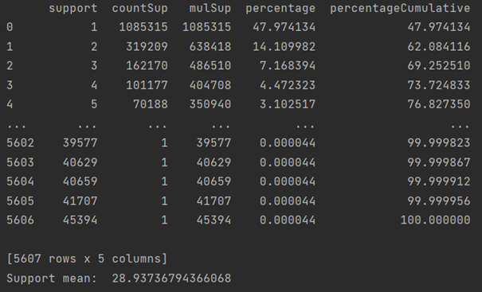

# 
 Data Science WS 2021/2022   Dokumentation 

## 
 Lösung der AI crowd Spotify Million Playlist Dataset Challenge mittels Assoziationsanalyse 

## Begrifflichkeiten
Um das grundsätzliche Verständnis zum Code und dieser Dokumentation zu fördern, erläutern wir im folgenden häufig verwendete Bergriffe bzw. Variablennamen:
* `items` = {`track_name`, `track_uri`, `artist_uri`,`album_uri`, `name` (Playlist-name), `pid`}
* `itemSet`: Eine Menge unterschiedlicher items gleicher Art, meistens in Form eines `frozensets` um sie einem `set` anzufügen zu können.
* `antecedents`: Eine Menge von Vorgängern in Form von `itemSets`, von denen ausgehend eine Vorhersage getroffen werden kann.
* `consequents`: Die Vorhersage (auch Nachfolger) in Form einer Menge von `itemSets`, welche durch eine Regel erzeugt wurde.
* `confidence`: Die Konfidenz steht für die Wahrscheinlichkeit, dass die Nachfolger eintreten, gegeben der Wahrscheinlichkeit, dass die Vorgänger bereits eingetroffen sind.
* `minSup`: Abkürzung von minimum Support. Bezeichnet die totale Anzahl von Transaktionen bzw. Playlists in denen ein `itemSet` vorkommen soll.  
* `rule` = `[{A, ...}, {B, ...}, Konfidenz]` bzw. `[antecedent, consequent, confidence]`  
  In den meisten Fällen bestehen beide Mengen aus nur einem Element. Eine Regel könnte also lauten:  
  `[{A}, {B}, 0.5]`.  
  In diesem Fall kann die Regel wie folgt gelesen werden:  
  "Wenn der Track A in der Playlist enthalten ist, wird zu 50% auch Track B enthalten sein."   
* `candidates`: Bezeichnet eine Menge von `itemSets`, welche noch nicht auf `minSup` geprüft sind.
* **frequent**: `itemSets` werden frequent genannt, wenn sie über `minSup` liegen.
* `maxPid`: Definiert die größtmögliche ***pid***, mit welcher das Programm rechnen soll. Dadurch wird die größe des Datensatzes bestimmt.  
  Beispiel: Liegt `maxPid` bei 1000, wird mit 1000 Playlists gerarbeitet.

## Ziel
Um die Challenge zu bewältigen, gilt es zwei Anforderungen an die Regeln zu stellen.
1. Wir benötigen mehrere Regeln pro Track. Je nach Szenario und Recommendation-Verfahren schwankt die Anzahl der Regeln, 
   die wir für einen einzelnen Track benötigen. Es gilt, je weniger Tracks wir gegeben haben, desto mehr Regeln 
   benötigen wir für einen einzelnen Track bzw. Playlist-Namen.
2. Wir benötigen für möglichst viele Tracks eine Regel. Je nach Szenario haben wir nur einen Track gegeben, 
   was bedeutet, dass wir für genau diesen Track mehrere Regeln gespeichert haben müssen.
   
Zudem gehen wir davon aus, dass wir nicht wissen für welche Tracks wir eine Vorhersage treffen sollen. Das heißt, 
wir speichern bestenfalls für jeden der ca. 2 Mio. Tracks aus unserem Datensatz eine Regel.

Um die Anzahl derer Tracks zu maximieren, für die wir eine Regel zur Verfügung haben, dient uns als wichtigster 
Parameter `minSup`. Um so kleiner `minSup` gewählt wird, für umso mehr Tracks erhält man eine Regel. 
Damit wir wissen, wie groß wir `minSup` wählen können, um dennoch genug Regeln zu erstellen, haben wir uns eine Methode 
`printSupInfo(item)` geschrieben, welche auflistet, wie oft welcher Support vorkommt.

## Preprocessing
## Ansatz I - Vorhandenes Repository umbauen
In unserem ersten Ansatz haben wir versucht ein bestehendes Repository (s. https://github.com/chonyy/apriori_python) 
für unseren Anwendungsfall zu nutzen und dementsprechend umzubauen. 
Diesen Ansatz haben wir in der Datei **apriori_first.py** festgehalten.

Das Dokument besteht im Wesentlichen aus drei Methoden:
* `getAboveMinSup(candidateTrackSets, playlistSets, minSup, globalTrackSetWithSup)`:  
  Iteriert für jeden Kandidaten aus `candidateTrackSets` über alle Playlists aus `playlistSets` und zählt dabei, in wie vielen Playlists jeder Kandidat vorkommt.  
  Der Aufwand kann daher wie folgt berechnet werden: `len(playlistSets)` * `len(candidateTrackSets)`.  
* `getUnion(trackSets, length)`: Berechnet aus frequent `trackSets` der Länge k, Kandidaten der Länge k+1, indem sie für jedes `trackSet` über alle `trackSets` iteriert und mit jedem eine Vereinigung bildet.  
  Der Aufwand liegt daher bei `len(trackSets)` * `len(trackSets)`
  
* `aprioriFromDB(maxPlaylists, minSup, minConf=0.5, kMax=2)`: Ruft die zuvor genannten Methoden so oft auf, bis die `itemSets` so lang sind, dass keines der `itemSets` mehr über `minSup` liegt. 

Der genaue Aufbau der Parameter kann den docstrings in den entsprechenden Methoden entnommen werden.

### Umbau
Um die Methoden des Repositories nutzen zu können haben wir uns in der Datei **db.py** eine Methode `getFromDB(maxPid)` geschrieben, welche abhängig von der `maxPid` eine Datenbank-Abfrage durchführt und damit das `trackSet` sowie das `playlistSet` generiert.
Diese sind bereits so formatiert, dass sie als Input für `getAboveMinSup()` genutzt werden können.

Zudem haben wir uns eine Reihe von `print`-Befehlen in der Methode `aprioriFromDB()` ausgeben lassen, um die Programmabläufe analysieren zu können. 

### Probleme
#### I - `getUnion()` liefert

## Ansatz II - Dictionaries verwenden
### Funktionsweise
### Probleme
#### I - Es werden zu viele Regeln erstellen
#### II - Terminiert nicht für 1. Millionen Playlists
#### III - Datenbank-Abfrage dauert zu lange
### Lösungen
#### I
#### II
#### III
## Ansatz III - Library von mlxtend verwenden 
## Code-Struktur
* **preprocessingToCSV.py**
* **apriori_first.py**
* **apriori_spotify.py**
* **db.py**
* **helperMethods.py**
* **progressBar.py**
* **apriori_mlxtend.py**
* **recommendation.py**
* ***src/mpd_tools***
* ***challenge***
* ***data***
* ***data_processed***
* ***data_rules***

