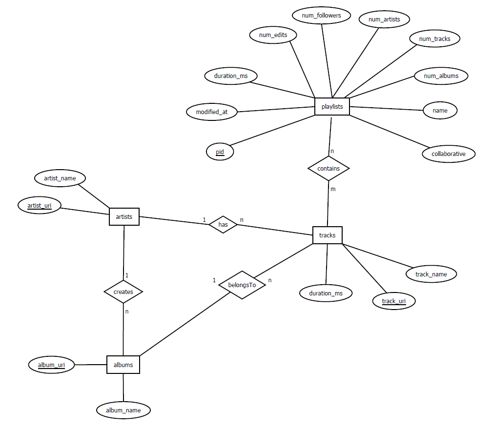

# <center> Data Science WS 2021/2022 <br/> Dokumentation - Lösung der AI crowd Spotify Million Playlist Dataset Challenge mittels Assoziationsanalyse

**Hinweis**: Um die gezeigten Code-Ausschnitte in dieser Dokumentation auszuführen, muss ein ssh-Tunnel zur Datenbank bestehen. 
Eventuell müssen vor Ausführen mancher Methoden auch bestimmte csv-Dateien erstellt werden. Es empiehlt sich hierzu das How-to-use zu lesen.   
## Gliederung
* Begrifflichkeiten   
* Ziel
* Preprocessing
* Ansatz I - Vorhandenes Repository umbauen
  * Umbau
  * Probleme  
* Ansatz II - Dictionaries verwenden
  * Idee
  * Probleme
    * Preprocessing & Implementierung
* Ansatz III - Libary von mlxtend verwenden    
* Recommendation
  * Ansätze
* Code-Struktur und Arbeitsaufteilung
  * Verweis auf zweites Readme


## Begrifflichkeiten
Um das grundsätzliche Verständnis zum Code und dieser Dokumentation zu fördern, erläutern wir im folgenden häufig verwendete Bergriffe bzw. Variablennamen:
* `items` = {`track_name`, `track_uri`, `artist_uri`,`album_uri`, `name` (Playlist-name), `pid`}
* `itemSet`: Eine Menge unterschiedlicher items gleicher Art. Meistens in Form eines `frozensets` um sie einem `set` anzufügen zu können.
* `c1ItemSet`: ItemSets der Länge 1, welche auch unter `minSup` liegen
* `l1ItemSet`: ItemSets der Länge 1, welche über `minSup` liegen
* `l2ItemSet`: ItemSets der Länge 2, welche über `minSup` liegen
* `antecedents`: Eine Menge von Vorgängern in Form von `itemSets`, von denen ausgehend eine Vorhersage getroffen werden kann.
* `consequents`: Die Vorhersage (auch Nachfolger) in Form einer Menge von `itemSets`, welche durch eine Regel erzeugt werden kann.
* `confidence`: Die Konfidenz steht für die Wahrscheinlichkeit, dass die Nachfolger eintreten, gegeben der Wahrscheinlichkeit, dass die Vorgänger bereits eingetroffen sind.
* `minSup`: Abkürzung von minimum Support. Bezeichnet die totale Anzahl von Transaktionen bzw. Playlists in denen ein `itemSet` vorkommen soll.  
* `rule` = `[{A, ...}, {B, ...}, Konfidenz]` bzw. `[antecedent, consequent, confidence]`  
  In den meisten Fällen bestehen beide Mengen aus nur einem Element. Eine Regel könnte also lauten:  
  `[{A}, {B}, 0.5]`.  
  In diesem Fall kann die Regel wie folgt gelesen werden:  
  "Wenn der Track A in der Playlist enthalten ist, wird zu 50% auch Track B enthalten sein."   
* `candidates`: Bezeichnet eine Menge von `itemSets`, welche noch nicht auf `minSup` geprüft ist.
* **frequent**: `itemSets` werden frequent genannt, wenn sie über `minSup` liegen.
* `maxPid`: Definiert die größtmögliche ***pid***, mit welcher das Programm rechnen soll. Dadurch wird die größe des Datensatzes bestimmt.  
  Beispiel: Liegt `maxPid` bei 1000, wird mit 1000 Playlists gerarbeitet.

## Ziel
Um die Challenge zu bewältigen, gilt es zwei Anforderungen an die Regeln zu stellen.
1. Wir benötigen mehrere Regeln pro Track. Je nach Szenario und Recommendation-Verfahren schwankt die Anzahl der Regeln, 
   die wir für einen einzelnen Track benötigen. Es gilt, je weniger Tracks wir gegeben haben, desto mehr Regeln 
   benötigen wir für einen einzelnen Track bzw. Playlist-Namen.
2. Wir benötigen für möglichst viele Tracks eine Regel. Je nach Szenario haben wir nur einen Track gegeben, 
   was bedeutet, dass wir für genau diesen Track mehrere Regeln gespeichert haben müssen.
   
Zudem gehen wir davon aus, dass wir nicht wissen für welche Tracks wir eine Vorhersage treffen sollen. Das heißt, 
wir speichern bestenfalls für jeden der ca. 2 Mio. Tracks aus unserem Datensatz eine Regel.

Um die Anzahl derer Tracks zu maximieren, für die wir eine Regel zur Verfügung haben, dient uns als wichtigster 
Parameter `minSup`. Um so kleiner `minSup` gewählt wird, für umso mehr Tracks erhält man eine Regel.  
Damit wir wissen, wie groß wir `minSup` wählen können, um dennoch genug Regeln zu erstellen, haben wir uns eine Methode 
`printSupInfo(item)` geschrieben, welche auflistet, wie oft welcher Support vorkommt.

```
printSupInfo('track_uri')
```


Wie man in der vierten Spalte erkennen kann, haben 47% aller Tracks nur einen Support von 1. 
Für all diese Tracks lassen sich daher keine aussagekräftigen Regeln bilden. Wir haben uns gefragt, ob das eventuell an 
der Eindeutigkeit der ***track_uri*** liegt und eigentlich gleiche Tracks wegen unterschiedlicher Versionen
oder doppelten Uploads nicht als mehrfach gezählt werden können.
Wir haben die Methode deshalb auch für den ***track_name*** durchlaufen lassen, welchen wir zusammen setzten aus
`track_name + " by " + artist_name`.

```
printSupInfo('track_name')
```


Das Ergebnis ist leider ziemlich das gleiche.  
Wir haben die Methode auch für die Künstler, Alben und Playlist-Namen aufgerufen:

```
printSupInfo('artist_uri')
```


```
printSupInfo('album_name')
```


Das Ergebnis für die Alben und Künstler ist ähnlich, auch für diese lassen sich nicht viel mehr Tracks für Regeln finden.
Wir haben die Methode auch für ***album_name*** und ***artist_name*** aufgerufen, aber auch für diese Attribute war die Ausgabe
ähnlich.
Daraus lässt sich ableiten, dass sich für Rund die Hälfte der Tracks aus unserem Lerndatensatz keine
aussagekräftigen Regeln ableiten lassen.

Für die Playlist-Namen ist der prozentuale Anteil derer, die einen Support von 1 haben jedoch deutlich geringer: 

```
printSupInfo('name')
```


Das lässt vermuten, dass die Assoziationsanalyse für diesen Bestandteil am besten funktionieren wird.

## Preprocessing
Zu Beginn unserer Arbeit haben wir uns überlegt den vollständigen 33GB großen Datensatz
vom JSON-Format in das CSV-Format zu überführen. Dies hat einerseits den Vorteil, dass der
Speicherbedarf der CSV-Dateien wesentlich geringer ist. Im Json-Format ist eine große Menge an
Redundanz durch Bezeichner wie "track_uri" gegeben die im CSV-Dateien nur einm einziges Mal
im Header gespeichert sind. Der zweite Vorteil ist, dass man CSV mit einem einzigen Befehl in
PostgreSQL Datenbanken laden kann.

### DB-Schema
Bevor wir unsere Daten transformiert haben, haben wir schrittweise ein geeignetes
Datenbank-Schema entwickelt. Zunächst hatten wir ein Star-Schema, dass sich in der
Nachbesprechung als ineffizient bei Abfragen herausstellte. Das Problem war, dass die
Verknüpfungstabelle "soulOfStar" mit all ihren Attributen zu breit war und bei einer
Länge von 66mio Zeilen zu groß war um diese schnell zu durchlaufen.

Aufgrund der schlechten Performance haben wir das Schema dann überarbeitet und primär die 
Zuordnungstabelle schmaler gebaut. Diese ist im Schema mit der n:m-Beziehung `contains`
dargestellt und speichert eine Playlist-ID (pid), die jeweilligen `track_uri` und `pos`,
also Position des Tracks in der Playlist.


### Generierung CSV-Dateien
Wir müssen also nun die JSON-Daten in 5 CSV-Dateien mit Python transformieren:

* tracks
* artists
* albums
* playlists
* playlist contains tracks (im folgenden mit pConT abgekürzt)

Dafür haben wir eine Funktion `csvForDb(maxFiles)` geschrieben, die `maxFiles` viele der 
1000 JSON-Dateien konvertiert, konkateniert und in einer der fünf CSV-Dateien speichert.
Wir lesen alle Dateien aus dem Quellordner der JSON-Dateien ein:

    filenames = os.listdir(pathToData)
    for filename in sorted(filenames, key=natural_keys):
        if not filename.startswith('mpd.slice.') and filename.endswith(".json") or i > maxFiles:
            break

Dann rufen wir eine zweite Funktion `createDfsForDb(filename)` auf, welche die Daten in einen
pandas Dataframe lädt. Die Funktion gibt eine Liste der fünf Dataframes zurück. Dann können
die entsprechenden Dataframes in CSV-Dateien gespeichert werden:

    for df, name in zip(createDfsForDb(filename), ["playlists", "artists", "tracks", "albums", "pConT"]):
                saveDF2CSV(df, f'{name}_{maxFiles}.csv', mode='a', header=(i == 1))

Der wichtigste Teil unserer Funktion `createDfsForDb(filename)` ist das flatten der JSON-Daten
mit der pandas Funktion `json_normalize`. Die JSON-Dateien öffnen wir erst per File-Deskriptor
und verarbeiten diese dann mit `json_normalize`. Als `record_path` geben wir der Funktionan,
was wir aus der JSON-Datei flatten möchten und erhalten den Dataframe, den wir im folgenden
eben in die fünf Dataframes umbauen und zurückgeben.

    data = getDataFromJson(filename)
    df_playlists = pd.json_normalize(
        data,
        record_path=['playlists'],
        max_level=1
    )

    df_pConT = pd.json_normalize(
        data['playlists'],
        record_path=['tracks'],
        meta=[
            'pid'
        ]
    )

Da wir nun jede Playlist eingelesen haben, existieren noch unzählige Duplikate in unseren 
CSV-Dateien, die wir bequem mit der Funktion `df.drop_duplicates()` entfernen konnten.

### CSV-Dateien in die DB laden
Die CSV-Dateien haben wir dann sehr einfach mit z.B. folgenden Befehl in die Datenbank laden
können:

    \copy tracks FROM '/.../tracks_1000.csv' DELIMITER ',' CSV HEADER

Dabei war darauf zu achten die Tabellen in der richtigen Reihenfolge zu befüllen, da manche 
von einer anderen abhängig waren durch Fremdschlüssel-Referenzen.

### Daten aus der DB abfragen
Für unseren ersten Ansatz, den Apriori aus dem Git-Repo zu verwenden, haben wir uns eine 
Funktion `getFromDB(maxPid)` gebaut. Diese fragt die entsprechenden Daten aus der DB ab und 
bringt diese ins erste benötigte Input-Format für den Algorithmus. Dazu fragen wir mit folgendem
Select `track_uri` und `pid` ab und erhalten eine Liste aus Tupeln:
    
    tracks = _dbReq(f'SELECT track_uri, pid FROM pcont WHERE pid<{maxPid}')

Die Funktion `_dbReq` wird bei `Ansatz III - Library von mlxtend verwenden` genauer erläutert.
        
        playlists = []
        unique_tracks = set()
        playlistCounter = 0
        record = set()
        
        for track in tracks:
            if playlistCounter != track[1]:  # switch from playlist i to playlist i+1
                playlistCounter += 1
                playlists.append(record)
                record = set()
            track_uri = track[0]
            record.add(track_uri)
            unique_tracks.add(frozenset([track_uri]))
            playlists.append(record)
        return unique_tracks, playlists

Dann iterieren wir über alle angefragten tracks, müssen aber wieder tracks in die korrekte
Playlist einordnen. Deshalb haben wir auch `pid` mit ausgeben lassen und können so wieder
erfassen welcher track zu welcher playlist gehört. Dann erstellen wir für jede Playlist ein set
und speichern diese in eine Liste. Zusätzlich generieren wir eine Liste mit allen Tracks, die unique
ist.


## Ansatz I - Vorhandenes Repository umbauen
In unserem ersten Ansatz haben wir versucht ein bestehendes Repository (s. https://github.com/chonyy/apriori_python) 
für unseren Anwendungsfall zu nutzen und dementsprechend umzubauen. 
Diesen Ansatz haben wir in der Datei **apriori_first.py** festgehalten. Leider mussten wir diesen Ansatz verwerfen,
da er für größere Eingaben (ab 2000 Playlists) nicht terminierte.

Das Dokument besteht im Wesentlichen aus drei Methoden:
* `getAboveMinSup(candidateTrackSets, playlistSets, minSup, globalTrackSetWithSup)`:  
  Iteriert für jeden Kandidaten aus `candidateTrackSets` über alle Playlists aus `playlistSets` und zählt dabei, in wie vielen Playlists jeder Kandidat vorkommt.  
  Der Aufwand kann daher wie folgt berechnet werden: `len(playlistSets)` * `len(candidateTrackSets)`.  
* `getUnion(trackSets, length)`: Berechnet aus frequent `trackSets` der Länge k, Kandidaten der Länge k+1, indem sie für jedes `trackSet` über alle `trackSets` iteriert und mit jedem eine Vereinigung bildet.  
  Der Aufwand liegt daher bei `len(trackSets)` * `len(trackSets)`
  
* `aprioriFromDB(maxPlaylists, minSup, minConf=0.5, kMax=2)`: Ruft die zuvor genannten Methoden so oft auf, bis die `itemSets` so lang sind, dass keines der `itemSets` mehr über `minSup` liegt. 

Der genaue Aufbau der Parameter kann den docstrings in den entsprechenden Methoden entnommen werden.


### Umbau
Um die Methoden des Repositories nutzen zu können haben wir uns in der Datei **db.py** eine Methode `getFromDB(maxPid)` geschrieben, welche abhängig von der `maxPid` eine Datenbank-Abfrage durchführt und damit das `trackSet` sowie das `playlistSet` generiert.
Diese werden so formatiert, dass sie als Input für `getAboveMinSup()` genutzt werden können.

Zudem haben wir uns eine Reihe von `print`-Befehlen in der Methode `aprioriFromDB()` ausgeben lassen, um feststellen zu können, warum das Programm nicht terminiert.
Die Ausgaben der `print`-Befehle werden im folgenden genauer analysiert. 

### Probleme
#### I - `getUnion()` liefert zu viele Kandidaten für `getAboveMinSup()`
Wie oben bereits beschrieben, iteriert `getUnion()` für jedes `trackSet` über alle `trackSets` und bildet davon ausgehend, alle möglichen Vereinigungsmengen.
Es wird lediglich geprüft, ob die Größe der Vereinigungsmenge `k` entspricht. 
Wir haben geprüft, wie groß der Output dieser Methode ist und festgestellt, dass die Größe der Ausgabe für `k = 2` genau der Anzahl aller zwei-elementigen Teilmengen über `trackSets` entspricht.

Dazu haben wir in der Datei **apriori_first.py** folgenden Befehl ausgeführt:
```
aprioriFromDB(maxPlaylists=2000, minSup=10, kMax=2)
```
Für 2000 Playlists und `minSup = 10` beträgt die Größe des Eingabeparameters `trackSets` 2188. Die Größe der Ausgabe (bestehend aus `trackSets` der Länge 2) beträgt 2.392.578.
Das entspricht genau der Menge an zwei-elementigen Teilmengen von 2188, welche sich mit der Binominalzahl berechnen lässt.
Die Rechnung dazu lautet: 2188 * 2187 / 2.
Das Problem ist nun, dass `getAboveMinSup()` eine Menge mit über 2 Mio. Elementen übergeben bekommt und für jedes Element über alle Playlists (in diesem Fall 2000) iterieren muss.
Das bedeutet, dass `getAboveMinSup()` bereits für 2000 Playlists (bei relativ hohem `minSup`) nicht terminiert.

#### II - `getUnion()` terminiert für größere Eingaben nicht
Nach der oben beschriebenen Komplexität werden für `trackSets` der Länge 2188, ca. 5 Mio. = 2188 * 2188   Iterationen durchgeführt.
Die Methode benötigt dazu auf unseren Computern ca. 15 Sekunden.
Setzen wir `minSup` runter auf 2 (was wir brauchen um möglichst viele Regeln zu bauen) muss `getUnion()` bereits mit 17349 `trackSets` rechnen und terminiert nicht, bzw. müsste ca. 300 Mio. Iterationen durchführen und dafür ca. 15 Minuten benötigen.
Um für die Challenge genug Regeln zu bilden, müssen wir jedoch mit ca. 100.000 `trackSets` rechnen und die Methode würde definitiv nicht terminieren (ca. 5 Mrd. Iterationen).  

#### III - Laufzeit von `getAboveMinSup()` steigt enorm mit wachsender Anzahl von Playlists
Wie oben beschrieben, ist die Komplexität von `getAboveMinSup()` nicht nur von den `trackSets` abhängig, sondern auch von der Anzahl der Playlists.
Dadurch bringt es uns nichts, die Ausgabe von `getUnion()` kleiner zu halten. Denn wenn über 1 Mio. Playlists iteriert werden muss, reichen 10.000 `trackSets` aus, damit die Methode nicht terminiert.

## Ansatz II - Dictionaries verwenden
Um die Probleme von Ansatz I lösen zu können, haben wir uns dazu entschieden den Apriori-Algorithmus selbst zu programmieren und für unseren Anwendungsfall zu optimieren.
Dieser Ansatz hat es uns letztendlich ermöglicht, die Assoziationsanalyse für 1 Mio. Playlists auf unseren Computern auszuführen, um so genug Regeln für die Challenge speichern zu können.
Der Ansatz kann in der Datei **apriori_spotify.py** begutachtet werden.

### Idee
Grundsätzlich war die Idee, nicht quadratisch über alle frequent ItemSets zu iterieren und stumpf alle möglichen Kombinationen zu erstellen, sondern nur Vereinigungen mit ItemSets zu bilden, die aus gleichen Playlists stammen. 
Es ergibt schließlich keinen Sinn, Vereinigungen mit ItemSets zu bilden, die aus disjunkten Playlists stammen und dann ohnehin im Folgeschritt durch `minSup` rausgefiltert werden.

Mit der Methode `printSupInfo('track_uri')` (s. Screenshots oben) haben wir gesehen, dass ein Track durchschnittlich in nur 28 Playlists vorkommt.
Es müssen also nicht für jeden Track Vereinigungen mit Tracks aus 1 Mio. Playlists gebildet werden, sondern es reicht Vereinigungen mit Tracks aus durchschnittlich 28 Playlists zu generierenn

Der grobe Aufbau um Kandidaten zu bilden sieht daher wie folgt aus:

```
for itemSet1 in frequentItemSets:
    for playlist in itemSet1.playlists:
        for itemSet2 in playlist.frequentItemSets:
            candidates.append(itemSet1.union(itemSet2))
```

Diese dreifache for-Schleife ersetzt die Methode `getUnion()`. Es gehen dabei keine Vereinigungen verloren, die im nächsten Schritt nicht sowieso entfernt worden wären.

Um von einem itemSet durch dessen Playlists zu iterieren und von einer Playlist durch deren itemSets zu iterieren, arbeiten wir mit zwei Dictionarys. Diese werden für jede Länge der itemSets neu erstellt und ermöglichen extrem schnelle Zugriffe.
Die Dictionaries haben die Bezeichnungen:
* `itemSet2Pids`: Ordnet jedem itemSet eine Menge von ***pids*** zu und hat drei Funktionen:
  1. Man kann für jedes itemSet über deren ***pids*** iterieren
  2. Man kann über die Länge der ***pids*** den Support eines itemSets abfragen: `len(pids) = sup`
  3. Über die Schnittmenge der ***pids*** lässt sich der Support von Vereinigungen berechnen (s. Foliensatz "Recommender Systeme" S. 29 - Erweiterung Apriori-TID)
* `pid2itemSets`: Ordnet jeder Playlist eine Menge von itemSets zu. 

Mit dem Dictionary `itemSet2Pids` kann direkt im Schleifendurchlauf der Support geprüft werden und die Methode `getAboveMinSup()` wird komplett hinfällig.
Die dreifache for-Schleife sieht dann wie folgt aus:

```
for itemSet1 in itemSet2Pids:
    for playlist in itemSet2Pids[itemSet1]:
        for itemSet2 in pids2ItemSets[playlist]:
            if itemSet2Pids[itemSet1].intersection(itemSet2Pids[itemSet2]) >= minSup:
                nextFrequentItemSets.append(itemSet1.union(itemSet2))
```

Die **Validierung** haben wir anhand des ersten Ansatzes und einer kleinen Datenmenge durchgeführt: 

**apriori_first.py**:
```
aprioriFromDB(maxPlaylists=300, minSup=2, kMax=2)
```
Nach ca. 85 Sekunden erscheint folgender Output im Terminal: 

```
getUnion for k = 2 ... -> Done! 3376101 Candidates
getAboveMinSup for k = 2 ... -> Done! 19745 Tracks above minSup
```

**apriori_spotify.py**:
```
aprioriSpotify(item='track_uri', maxPid=300, minSup=2, kMax=2, b=-1, dbL1ItemSets=True)
```

Nach ca. 4 Sekunden erscheint folgender Output im Terminal: 
```
k:  2 -> 19744 itemSets
```

**Fazit**: Deutlich schneller mit gleichem Ergebnis. Bzw. in diesem Beispiel ist 1 itemSet verloren gegangen. Für kleinere 
Eingaben ist die Anzahl jedoch exakt identisch.

Ein **Rechenbeispiel** verdeutlicht die Verbesserung:

Gegeben: 
* 1 Mio. frequentItemSets (diese entstehen, wenn die ***track_uris*** vom gesamten Datensatz auf `minSup = 2`geprüft werden)
* Durchschnittlich 28 Playlists in der ein Track bzw. eine ***track_uri*** vorkommt.
* Durschnittlich 25 frequent Tracks pro Playlists (Schätzung: Die durchschnittliche Playlist-Länge beträgt 66, ca. die Hälfte fällt durch `minSup = 2` weg und weitere Tracks fallen wegen Dopplung weg)

Rechnung:
* `getUnion()` führt 1 Mio * 1 Mio = 1 Billionen Iterationen durch und generiert 1.000.000 * 999.999 / 2 = ca. 500.000.000. 
  Danach führt `getAboveMinSup()` 500.000.000 * 1.000.000 Iterationen durch.
* Unsere Variante führt 1 Mio * 28 * 25 = 700 Mio. Iterationen durch und liefert das gleiche Ergebnis.


### Probleme & Lösungen
Trotz der deutlichen Performance-Steigerung gab es auch für diesen Ansatz noch Optimierungsbedarf.

#### I - Keine lineare Laufzeit

Wir haben den Ansatz für verschieden viele Playlists getestet und uns langsam gesteigert.
Für 10.000 Playlists benötigt das Programm ca. 4 Minuten, für 40.000 Playlists ca. 30 Minuten und für 100.000 Playlists 
ca. 6-8 Stunden. Letzteres haben wir allerdings bei der Hälfte der Laufzeit abgebrochen.

Der Ergebnisse können wie folgt reproduziert werden:

**Hinweis**: Zum Zeitpunkt als das Problem aufgetreten ist, gab es die Parameter `b` und `p` noch nicht.
Sie wurden deshalb zur Reproduktion auf -1 gesetzt.

```
aprioriSpotify(item='track_uri', maxPid=10000, minSup=2, kMax=2, b=-1, p=-1, dbL1ItemSets=True)
aprioriSpotify(item='track_uri', maxPid=40000, minSup=2, kMax=2, b=-1, p=-1, dbL1ItemSets=True)
aprioriSpotify(item='track_uri', maxPid=100000, minSup=2, kMax=2, b=-1, p=-1, dbL1ItemSets=True)
```

Um das Problem zu lösen haben wir zunächst analysiert, warum die Laufzeit nicht linear ansteigt.
Wir haben festgestellt, dass die Ursache bei Tracks liegt, die einen sehr hohen Support haben.
Wenn wir uns den oben gezeigten Screenshot nochmal ansehen, erkennt man, dass es Tracks mit einem Support von bis zu 45394 gibt.


Außer diesem Track gibt es natürlich noch viele weitere Tracks für die jeweils über tausende Playlists iteriert werden muss.
Der Grund für den nicht-linearen Zeitaufwand liegt also daran, dass für einen größen Datensatz der durchschnittliche Support von items steigt.

Wir haben deshalb beschlossen, einen weiteren Parameter `p` einzuführen, der die Anzahl an Iterationen für ein einzelnes itemSet limitiert.

Ein Test hat gezeigt, dass Laufzeit nun eher linear ist:
```
aprioriSpotify(item='track_uri', maxPid=20000, minSup=2, kMax=2, b=-1, p=10, dbL1ItemSets=True)
```

**Dauer:** 2 min. 16 Sekunden für 101.431 Tracks (Gesamt: 2.262.292 Tracks) 

```
aprioriSpotify(item='track_uri', maxPid=40000, minSup=2, kMax=2, b=-1, p=10, dbL1ItemSets=True)
```

**Dauer:** 4 min. 9 Sekunden für 164.664 Tracks (Gesamt: 2.262.292 Tracks) 

Es ist logisch, dass wir damit noch immer keine lineare Komplexität erreichen. Denn umso größer der Testdatensatz wird, umso mehr items wird es geben, die die Grenze von `p` Playlists voll ausschöpfen.
Ist der Datensatz kleiner, gibt es viele items, die die Grenze von `p` nicht erreichen und somit entstehen noch weniger Iterationen.
Dennoch haben wir damit eine deutliche Verbesserung erzielt, die ein Durchlaufen für 1 Mio. Playlists ermöglicht hat.

Man könnte sich nun fragen, ob dadurch wichtige Vereinigungen nicht gebildet werden können und damit gute Regeln verloren gehen.
Tatsächlich ist es aber in unserem Fall so, dass wir damit ein besseres Ergebnis erzielt haben.
Dafür gibt es zwei Gründe:
1. **Die "guten" Vereinigungen fallen wahrscheinlich nicht weg.**  
   Die "guten" Vereinigungen (bzw. später die Regeln) sind die, dessen Support möglichst nahe an den Support von einem einzelnen itemSet herankommen.
   Das ist genau dann der Fall, wenn das zweite itemSet in vielen Playlists vom ersten itemSet vorkommt.
   Da wir mit `sets` arbeiten, sind die `p` Playlists zufällig. Wenn wir nun mit itemSets aus `p` Playlists Vereinigungen bilden, ist es wahrscheinlich, dass wir Vereinigungen mit itemSets bilden, die ein hohes Vorkommen aufweisen.  
   **Beispiel:**  
   - itemSet1 hat einen Support von 42.
   - itemSet2 kommt in 21 Playlists von itemSet1 vor, d.h. der Support der Vereinigung beträgt 21.
   - Die Konfidenz der Regel itemSet1 -> itemSet2 liegt damit bei 50%
   - Nun iterieren wir durch 10 zufällige Playlists der 42 Playlists und bilden Vereinigungen
   - Die Wahrscheinlichkeit bei 10 Durchläufen **nicht** auf itemSet2 zu stoßen, liegt bei:  
     21/42 * 20/41 * 19/40 * 18/39 * 17/38 *...   
     = `(math.factorial(21) / math.factorial(21-10)) / (math.factorial(42) / math.factorial(42-10)) * 100`  
     = 0,02 %
   - Dementsprechend liegt die Wahrscheinlichkeit bei 99,98 % in 10 Schleifendurchläufen auf itemSet2 zu stoßen.
    
    Je kleiner der Support eines itemSets ist, desto Wahrscheinlicher reichen `p` Schleifendurchläufe aus um alle Vereinigungen über `minSup` zu finden.  
    Je größer der Support eines itemSets ist, desto mehr konvergiert die Formel für die Berechnung der Wahrscheinlichkeit `1 - pow(conf, p)`.
    Dementsprechend liegt die geringste Wahrscheinlichkeit alle "guten" Vereinigungen zu finden für `minConf=0.5` und `p=10` bei 99,90 %.
    
    
2. **In Verbindung mit `b` gibt es weniger Überschneidung**  
  
  
    
    
   
   


#### II - Es werden zu viele Regeln erstellt
#### III - Datenbank-Abfrage dauert zu lange

## Ansatz III - Library von mlxtend verwenden
Um eine Assoziationsanalyse über unsere Spotofy Daten durchzuführen liegt es
Nahe eine Library zu verwenden, welche die benötigte Funktionalität bereits 
bereitstellt. Wir sind dabei auf Library mlxtend gestoßen, die z.B. Apriori [1] und Funktionen
zur Generierung von Assoziationsregeln [2] implementiert.

### Data-Input
Die benötigten Daten fragen wir aus unserer Datenbank ab. Bevor wir aber die Daten an die
entsprechende mlxtend Funktion übergeben können, müssen diese in das passende Format gebracht
werden. Dazu befindet sich in src/db die Funktion `getC1ItemSets` welche die Parameter item und
maxPid erwartet. Wir können also als item z.B. track_uri und als maxPid 3 übergeben. Dann
wird eine Anfrage an die Datenbank gesendet, um alle track_uri aus den ersten 3 Playlists zu
erhalten. 

    item = "track_uri"
    maxPid = 3
    _dbReq(f"SELECT string_agg(x.{item}::character varying, ',') "
                  f"FROM ({_getQueryUniqueItemsOfPlaylists(item, maxPid)}) AS x "
                  f"GROUP BY pid")

    = SELECT string_agg(x.track_uri::character varying, ',')
      FROM (SELECT track_uri, pid FROM pcont WHERE pid < 3 GROUP BY track_uri, pid) AS x
      GROUP BY pid

    = [('spotify:track:2nVHqZbOGkKWzlcy1aMbE7,spotify:track:1NXTEkIeRL59NK61QuhYUl,...),
       ('spotify:track:4E5P1XyAFtrjpiIxkydly4,spotify:track:1Y4ZdPOOgCUhBcKZOrUFiS,...),
       ('spotify:track:2SYa5Lx1uoCvyDIW4oee9b,spotify:track:1enx9LPZrXxaVVBxas5rRm,...)]

Zunächst führen wir eine Unterabfrage durch, die von der Funktion `_getQueryUniqueItemsOfPlaylists`
generiert wird. Wir erhalten eine Liste der Tracks aus den ersten 3 Playlist jeweils als
Tupel, wie unter dargestellt. Anschließend fügen wir mit der SQL-Funktion `string_agg` die
Tracks in der Spalte `track_uri` gruppiert nach der pid zusammen. Der Output wird eine Liste 
aus 3 Playlists mit den darin enthaltenen Tracks sein.
Diese SQL Select-Abfrage wird nun von der Funktion `_dbReq` verarbeitet, wo die Verbindung zur 
Datenbank hergestellt wird und die Anfrage versendet wird.

    _getQueryUniqueItemsOfPlaylists("track_uri", 3)
    = SELECT track_uri, pid FROM pcont WHERE pid < 3 GROUP BY track_uri, pid
    = [('spotify:track:2nVHqZbOGkKWzlcy1aMbE7', 1), ('spotify:track:4E5P1XyAFtrjpiIxkydly4', 0),...]

Jetzt bauen wir den Output noch so um, dass wir eine Liste die wiederum Listen als Items
enthält erhalten. Jede Liste repräsentiert eine Playlist und enthält Tracks als Items.

    dataset = [['Track0', 'Track1', 'Track2', 'Track3', 'Track4', 'Track5'],
               ['Track2', 'Track6', 'Track7', 'Track4', 'Track8', 'Track5'],
               ['Track6', 'Track1', 'Track2', 'Track7'],
               ['Track6', 'Track4', 'Track0', 'Track8']]

Jetzt sind die Daten in dem für mlxtend erforderlichen Format bereit für die weitere Analyse.
Anmerkung: Analog zu `track_uri`, kann man die Abfragen auch für `album_uri` und `artist_uri`
generieren um dann im weiteren Verlauf Regeln für Ablbums und Artists zu erzeugen.

### Die mlxtend Library
Zunächst überführen wir die Werte weiter in eine binäre Darstellung. Ein Track ist entweder in
der Playlist enthalten, dann ist der Wert in der Spalte True, ansonsten false. Dies erreichen
wir durch den TransactionEncoder von mlxtend. Dann erzeugen wir aus der Liste wieder einen
Dataframe.

    te = TransactionEncoder()
    te_ary = te.fit(dataset).transform(dataset)
    df = pd.DataFrame(te_ary, columns=te.columns_)

Der beispielhafte Dataframe sieht nun folgendermaßen aus:

        Track0  Track1  Track2  Track3  Track4  Track5  Track6  Track7  Track8
    0    True    True    True    True    True    True   False   False   False
    1   False   False    True   False    True    True    True    True    True
    2   False    True    True   False   False   False    True    True   False
    3    True   False   False   False    True   False    True   False    True

Die Funktion `fpgrowth` erzeugt nun alle Itemsets und berechnet den Support. Für unsere
Beispiel-Daten sagen wir die Items bzw Itemsets sollen in 2 von 4 Playlists vorkommen, der
Support ist also 50%. Den gleichen Output würde auch die mlxtend-Funktion
`apriori(df, min_support=0.5)` erzeugen. Jedoch ist `fpgrowth` für große Datenmenge besser 
geeignet, da es im Gegensatz zu apriori keine Kandidaten erzeugt. Stattdessen verwendet es die
frequent pattern tree Datenstruktur.

    frequentItemSets = fpgrowth(df, min_support=0.5)

         support   itemsets
    0      0.50        (0)
    1      0.50        (1)
    2      0.75        (2)
    ...
    19     0.50  (2, 4, 5)
    20     0.50  (2, 6, 7)
    21     0.50  (8, 4, 6)

Mit den `frequentItemSets` können wir schließlich die Regeln generieren. Wir rufen dazu die 
mlxtend-Funktion `association_rules` auf und übergeben `frequentItemSets`. Zusätzlich bestimmen
wir das wir über die Konfidenz ermittelt werden sll, ob eine Regel interessant ist.
`min_threshold` ist hierbei der Wert für die Konfidenz.

    rules = association_rules(frequentItemSets, metric="confidence", min_threshold=0.7)

        antecedents consequents  antecedent support  
    0          (5)         (2)                 0.5
    1          (5)         (4)                 0.5 
    2       (2, 4)         (5)                 0.5 
    ...
    17      (2, 7)         (6)                 0.5
    18      (6, 7)         (2)                 0.5
    19         (7)      (2, 6)                 0.5

### Probleme mit mlxtend
Zunächst wollten wir den Algorithmus für wenige Playlists testen. Dafür haben wir 100
Playlists geladen und mlxtend hat schon über 250.000 Itemsets generiert. Deshalb haben wir
in der mlxtend-Funktion `apriori` den Parameter `max_len` auf 2 gesetzt um nur noch Itemsets
der Länge 2 zu generieren. \
Für 10.000 Playlists funktionierte das auch nur noch, wenn wir
zusätzlich den Parameter `low_memory` auf True setzten. Dies hat laut der mlxtend-Dokumentation
zur Folge, dass der Algorithmus 3-6x länger braucht aber Speicher-schonend arbeitet. \
Bei 100.000 Plylists war dann selbst mit `low_memory=True` und `max_len=2` der Arbeitsspeicher
derat ausgelastet, dass das Program mit Swapping beginnen musste.

### References
[1] http://rasbt.github.io/mlxtend/user_guide/frequent_patterns/apriori/ \
[2] http://rasbt.github.io/mlxtend/user_guide/frequent_patterns/association_rules/
## Recommendation
Die Datei `recommendation.py` ist dafür zuständig, aus den vorher mit dem Apriori
angelegten Regeln eine CSV-Datei zu erstellen, die zu jeder Playlist aus der
`chalenge_set.json` Datei, 500 Lieder vorschlägt.

### `recommendation`
Die Recommendation-Methode ist unsere Hauptmethode zum Vorhersagen unserer Songs. Als erstes lädt sie
die erstellten CSV-Dateien mit den ausgewählten Regeln in CSV-Dateien:

    mpd_slice = getDataFromJson(filename="challenge_set.json", path='../')

    album2mostPopular = getMostPopular("album_uri2track_uris_sorted.csv")
    artist2mostPopular = getMostPopular("artist_uri2track_uris_sorted.csv")
    mostPopularTracks = getMostPopular("mostPopularTracks.csv")

    pname2track, track2track = getRuleDicts('track_uri')
    pname2artist, artist2artist = getRuleDicts('artist_uri')
    pname2album, album2album = getRuleDicts('album_uri')

Dann wird in einer Schleife alle Playlists durchgelaufen, um für jede eine 
Vorhersage durchzuführen:

    for playlist in mpd_slice['playlists']:

Als Erstes wird für jede Playlist kontrolliert, in welchem Szenario diese sich
befindet. Dies geschieht durch die `checkSzenario` Methode:

    szenario = checkSzenario(playlist)

Die Szenarien stehen in den Vorgaben der Challenge und wir nutzen diese um zuerkennen
ob es einen Playlist-Namen gibt, den wir zur Vorhersage nutzen können.

Als Erstes werden Vorhersagen anhand des Namens erstellt, außer es ist keiner
vorhanden (Szenario 4 und 6):

    myUpdate(albumPred, tryPredict(pname2album, pname, givenTracks))
    myUpdate(artistPred, tryPredict(pname2artist, pname, givenTracks))
    myUpdate(trackPred, tryPredict(pname2track, pname, givenTracks))

Dann werden Vorhersagen anhand der Songs getätigt. Hierbei werden die direkten
Regeln von Songs und die Regeln zu Künstler und Artist genutzt:

    myUpdate(albumPred, predForTrack(tracks, album2album, 'album_uri', givenTracks))
    myUpdate(artistPred, predForTrack(tracks, artist2artist, 'artist_uri', givenTracks))
    myUpdate(trackPred, predForTrack(tracks, track2track, 'track_uri', givenTracks))

Wenn nach den Vorhersagen zu dem Namen und Songs keine Ergebnisse zustande
gekommen sind, nutzen wir die am meisten vorkommenden Song unseres gesamten Datensatzes:

    if len(trackPred) == 0 and len(albumPred) == 0 and len(artistPred) == 0:
        print("Found", len(trackPred), "predictions for playlist:", playlist)
        myUpdate(trackPred, {track: 0 for track in mostPopularTracks[0:500]})

Danach wird eine Schleife viermal durchgelaufen, die zum Auffüllen unserer Vorhersagen dient. 
Sobald wir die Anforderung von 500 Song erreicht haben verlassen wir die Schleife sofort:

    for i in range(0, 4):
        kmax = (500 - len(trackPred)) // max(len(albumPred) + len(artistPred), 1)
        addPopular(trackPred, albumPred, album2mostPopular, kmax, givenTracks)
        addPopular(trackPred, artistPred, artist2mostPopular, kmax, givenTracks)
        if len(trackPred) >= 500: # enough predictions
            x1 += 1
            break
        albumPred.update(predForItem(albumPred, album2album, givenTracks))
        artistPred.update(predForItem(artistPred, artist2artist, givenTracks))
        trackPred.update(predForItem(trackPred, track2track, givenTracks))
        if len(trackPred) >= 500: # enough predictions
            x2 += 1
            break

Wenn auch diese Schleife es nicht geschafft hat genug Vorhersagen zu erstellen, erweitern
wir unsere Vorhersagen mit den Top Songs bis wir die 500 Songs erreicht haben.
    
    while len(trackPred) < 500:
        myUpdate(trackPred, {mostPopularTracks[i]: 0})
        i += 1

Am Ende jeder Playlist-Vorhersage wird die Methode `saveAndSortPrediction` aufgerufen,
welche unsere Vorhersagen sortiert, an globale Liste anfügt und beim letzten Aufruf
unsere gesamten Vorhersagen in einer `submission.csv` Datei speichert:

    saveAndSortPredictions(trackPred, count == 10000, playlist['pid'])

### `getRuleDicts`
Methode zum Erstellen von Dictionaries aus unseren vorher angelegten Regeln:

    def getRuleDicts(item): 
        pname2item = getRuleDict(f"1000_name2{item}.csv")
        item2item = getRuleDict(f"1000_{item}2{item}.csv")
        return pname2item, item2item

### `getMostPopular`
Diese Methode ist dafür zuständig die erfolgreichsten Tracks eines Albums oder Artist zu ermitteln:

    print(f"Load {filename}...", end='')
    df = readDF_from_CSV(filename, path='../data_rules/')
    if len(df.columns) == 1:
        return df['0'].tolist()

    df['0'] = df['0'].apply(lambda x: normalize_uri(x))
    df['1'] = df['1'].apply(lambda x: appendList(x))
    print(" -> Done!")
    return {row['0']: row['1'] for index, row in df.iterrows()}

### `myUpdate`
Methode zum Aktualisieren eines Dictionaries, durch ein anderes. Hierbei werden neue Einträge
eingefügt und bereits vorhandene Einträge ersetzt, wenn Eintrag in einem anderem Dictionary größer
ist:

    def myUpdate(consDict, extensionDict):
        for key in extensionDict:
            if key in consDict:
                consDict[key] = max(consDict[key], extensionDict[key])
            else:
                consDict[key] = extensionDict[key]

### `tryPredict`
Diese Methode nutzen wir unter anderem zur Vorhersage von Tracks, Artist und Alben anhand des Playlist-Namens.
Sie gibt ein Dictionary zurück welches die passenden Vorhersagen beinhaltet:

    def tryPredict(ruleDict, key, givenTracks):
        prediction = dict()
        if key in ruleDict:
            for rule in ruleDict[key]:
                if not rule[0] in givenTracks:
                    prediction.update({rule[0]: rule[1]})
        return prediction

### `predForTrack`
Methode zum Erstellen eines Dictionaries mit Song-Vorhersagen zu dem jeweiligen Item:

    predictions = dict()
    for track in tracks:
        myUpdate(predictions, tryPredict(dictItem, track[itemName], givenTracks))
    return predictions

### `predForItem`
Methode zum Erstellen von Item-Vorhersagen:

    predictions = dict()
    for item in items:
        myUpdate(predictions, tryPredict(dictItem, item, givenTracks))
    return predictions

### `addPopular`
Diese Methode nutzen wir um unsere Vorhersagen mit den erfolgreichsten Tracks der vorher durchgeführten
Album und Artist Vorhersagen zu füllen.

    for item in pred:
        i = 0
        for track in popDict[item]:
            if i > maxTracks or track in givenTracks:
                break
            i += 1
            myUpdate(trackPred, {track: pred[item]})

### `saveAndSortPredictions`
Methode zum Speichern der Vorhersagen mit Playlist-ID in einer globalen 
Submission-Liste. Beim letzten Durchlauf wird eine CSV Datei mit allen Ergebnissen
erstellt.

    tracks = list(trackPred.keys())
    tracks.sort(key=lambda x: trackPred[x], reverse=True) 
    row = [pid] 
    row.extend(tracks[0:500]) 
    submission.append(row) 
    if finish: 
        df = pd.DataFrame(submission)
        saveDF2CSV(df, 'submission.csv', path='../', header=False)
Am Anfang jeder Zeile unserer CSV-Datei steht die Playlist ID. Dann folgen die IDs unsere 500
Song-Vorschläge.:


### `checkSzenario`
Diese Methode nutzen wir zum Überprüfen in welchem Szenario sich die Playlist befindet.

### Abgeänderter Versuch

Unser oben beschriebenes Programm hat bei der Challenge auf AICrowd unser Team auf Platz 40 gebracht. Aber
es hat uns noch interessiert, wie gut die Artist zu Artist und Album zu Album Regeln überhaupt sind. Deshalb
haben wir das Programm so umgeschrieben, dass nur die Track zu Track und Playlist-Name zu Track genutzt werden: 

    trackPred.update(predForItem(trackPred, track2track, givenTracks))
    myUpdate(trackPred, predForTrack(tracks, track2track, 'track_uri', givenTracks))

Dies führte zu einem schlechteren Ergebnis auf AICrowd (420 Playlist, die wir mit den Top Songs auffüllen mussten
und alle Ergebniswerte auf der Webseite waren schlechter) und hat gezeigt, dass Artist und Alben wichtige Song-Eigenschaften
für die Vorhersage sind.
    
    420 incomplete from 10000
    Avg:  609.2427
    max:  1668

## Code-Struktur
* **preprocessingToCSV.py**
* **apriori_first.py**
* **apriori_spotify.py**
* **db.py**
* **helperMethods.py**
* **progressBar.py**
* **apriori_mlxtend.py**
* **recommendation.py**
* ***src/mpd_tools***
* ***challenge***
* ***data***
* ***data_processed***
* ***data_rules***

